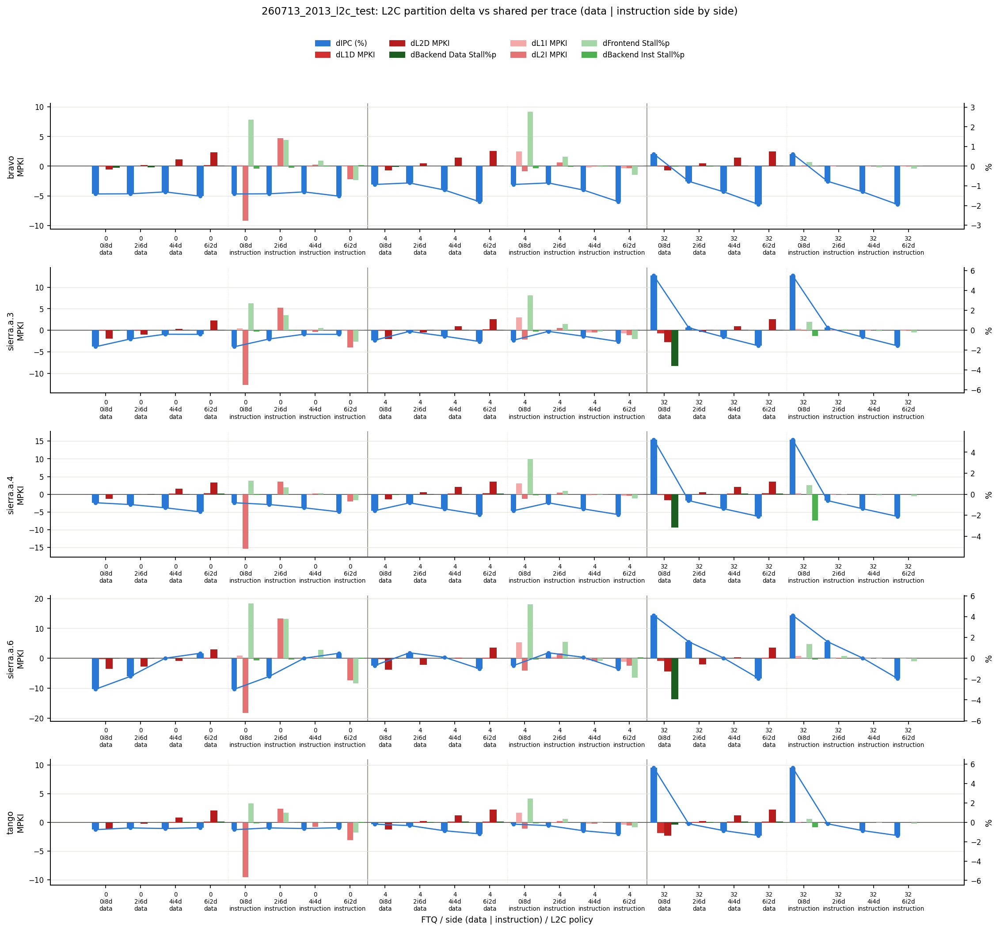

# 2026-07-14 분석 노트: L2C partition delta 그래프 만들기

`docs/exp/2026_07_14_experiment.md`(오늘의 실험 일지, Codex와 진행)에 있는 "Trace-FTQ-L2C 계층별 전체 변화량 표"를 그래프로 그려가는 과정을 별도로 기록한다. 최종 산출물은 `parser/l2c/delta_grid.py`(grid + overlay 두 그래프)와, 그 과정에서 같이 고친 `parser/fdip/cover/make_one_g.py`다.

## 출발점

`260713_2013_l2c_test` run(sierra.a.6/bravo/sierra.a.3/sierra.a.4/tango 5개 trace group, ftq 0/4/32, L2C partition 4종: shared/2i6d/4i4d/6i2d)의 delta 표를 그래프로 옮기고 싶다는 요청에서 시작했다. 표는 `shared` 정책을 기준선(0)으로 두고, 각 trace/ftq/policy 조합에서 9개 지표(dIPC, dL1I/L2I/L1D/L2D/L2C MPKI, dFrontend Stall%p, dBackend Inst/Data Stall%p)가 얼마나 벗어나는지를 보여준다.

## 1단계: Grid plot (`parser/l2c/delta_grid.py`)

`dataviz` 스킬을 먼저 로드하고 설계했다. 핵심 결정:

- **폼 선택**: 9개 지표 × 5개 trace를 한 번에 보여줘야 해서 small-multiples 그리드(trace=열, metric=행)로 결정.
- **"한 축(one axis)" 원칙**: dIPC(%)와 MPKI(count), stall%p(percentage point)는 단위가 전부 달라서 dual-axis로 억지로 합치지 않고, metric마다 별도 행(=별도 y축)으로 분리했다.
- **카테고리 색상**: L2C 정책 3개(2i6d/4i4d/6i2d, `shared`는 기준선이라 항상 0)를 dataviz 팔레트 순서(blue/aqua/yellow)로 고정.

`run_dir/summary/fdip_<ftq>/<policy>/metrics.csv`에서 직접 읽어와서 trace/ftq/policy를 전부 자동 탐색하도록 만들었다(하드코딩 없음). `scripts/run.sh`의 `-s 0x80` 비트로 연결해서, 관련 `metrics.csv`가 다 있으면 `l2c_delta_grid.png` 한 장이 나오게 했다.

## 2단계: Overlay — "경향성을 한눈에" 보고 싶다는 요청

Grid는 지표별로 행이 나뉘어 있어서 "이 9개 지표가 서로 비슷하게 움직이는지"를 한눈에 비교하기 어렵다는 지적이 있었다. 여러 번 반복하며 형태를 바꿨다.

### v1: 선 + 마커, trace를 열로, 정규화

처음에는 지표 9개를 각자의 최댓값(절댓값)으로 나눠 -1~+1로 정규화하고, trace마다 서브플롯 하나(가로로 나열), 지표마다 선+마커로 겹쳐 그렸다. 9개 지표는 색상만으로 구분하기 어려워서(CVD 안전 기준상 9번째 색을 새로 만들지 않는 게 원칙) `l2c_mpki`(=`l2i_mpki`+`l2d_mpki`의 합, 파생값)만 회색 점선+X마커로 다르게 표시했다.

### v2: 막대로, trace를 아래로 나열해서 너비 확보

"그냥 막대로 표현하고, 워크로드는 아래로 나열해서 너비를 확보하자"는 요청으로 바꿨다:
- 서브플롯을 trace마다 하나씩, **세로로(행으로) 쌓아서** 각 서브플롯이 전체 폭을 다 쓰게 했다.
- 선 대신 지표별 그룹 막대(9개 지표 × 9개 x축 위치(ftq 3 × policy 3)).
- "막대 끝을 연결하되 ftq 간에는 끊어라"는 요청에 따라, 각 지표의 막대 꼭대기를 잇는 선을 ftq 그룹 안에서만 그리고 ftq 경계(회색 세로선)에서는 끊었다.

### v3: 선 제거

"선 지우자 잘 안보인다" — 막대만 남기고 연결선은 완전히 뺐다. 훨씬 깔끔해졌다.

### v4: 정규화 제거, raw delta 값 그대로

"1이 normalize 한거 아니지? 그냥 delta 값을 값으로 표현해야한다"는 지적으로, 지표별 최댓값 정규화(→ ±1)를 없애고 **raw delta 값을 그대로** y축에 표시하도록 바꿨다. 이때부터 그래프 제목도 "normalized ..."에서 "raw values"로 고쳤다. 지표마다 단위가 달라서(%, MPKI, %p) 막대 높이를 서로 다른 지표끼리 직접 비교할 수는 없다는 걸 코드 주석과 설명에 남겼다.

## 3단계: `fdip_breakdown_combined.png`가 안 만들어지는 문제

Grid/overlay 작업과 별개로, 기존 `-s`의 `0x2`(fdip cover) 결과를 합치는 `parser/fdip/cover/make_one_g.py`가 `260713_2013_l2c_test`에서 `"No data found for configuration: FDIP Cover"`만 찍고 아무 파일도 안 만든다는 문제가 발견됐다.

**원인**: `-L2C` 기능(정책별 하위 디렉토리 + 파일명에 정책 접미사)이 추가되기 전 구조를 기준으로 짜인 코드였다.
- 옛 구조: `summary/fdip_<n>/fdip_<n>.txt`
- 현재 구조: `summary/fdip_<n>/<policy>/fdip_<n>_<policy>.txt` (레거시도 `_legacy` 접미사가 붙음)

`make_one_g.py`의 glob이 한 단계만 내려가고 정규식이 접미사 없는 파일명만 매치해서, 지금 구조의 파일을 전혀 못 찾고 있었다. `get_data_from_summary()`를 재귀 glob + 파일명에서 ftq/policy를 같이 파싱하도록 고쳐서, `{policy: DataFrame}` 형태로 정책별 데이터를 모으게 했다.

### 1개 그래프로 합치기

"1개의 그래프로 그리자. shared 2i6d / 4i4d 6i2d 위치로 해서"라는 요청으로, `plot_config`의 그리기 로직을 `plot_config_on_ax(df, config_name, ax)`로 뽑아내고, 2×2 서브플롯(`shared`|`2i6d` / `4i4d`|`6i2d`)에 각각 그린 뒤 범례는 상단에 한 번만 공유하는 `plot_combined_grid()`를 새로 만들었다. 정책이 1개뿐인(레거시 또는 `-L2C`로 하나만 고른) run은 기존처럼 단일 그래프로 처리해서 하위 호환을 유지했다.

## 4단계: MPKI delta도 %로

"mpki도 delta를 수치가 아닌 %로 계산하도록 변경"이라는 요청으로, `l1i_mpki`/`l2i_mpki`/`l1d_mpki`/`l2d_mpki`/`l2c_mpki`의 `kind`를 `"abs"`(raw 차이)에서 `"pct"`(`(policy/shared - 1) × 100`, dIPC와 동일한 계산식)로 바꿨다. `dFrontend Stall%p`/`dBackend Inst·Data Stall%p`는 이미 퍼센트 지표라서 그대로 `"abs"`(퍼센트 포인트 차이)로 뒀다 — "퍼센트의 퍼센트 변화율"은 의미가 이상해지기 때문이다.

바뀐 뒤로 `dL2I MPKI`처럼 `shared` 기준값 자체가 0에 가까운 지표는 변화율이 수백 %까지 튀는 경우가 생겼다(예: `bravo`/`ftq32`/`2i6d`에서 `+312%`). 계산은 맞지만 분모가 작아서 과장되어 보인다는 점을 별도로 짚어뒀다.

### 원본 수치 표 (delta 계산에 쓴 값, `shared` 포함)

아래 delta 표는 전부 이 원본 값들로부터 계산한 것이다(`shared` 행이 각 trace/ftq의 기준선). `IPC`는 비율값(단위 없음), `L1I/L2I/L1D/L2D/L2C MPKI`는 instructions 1000개당 miss 횟수, `Stall%` 3개는 실제 퍼센트다.

| Trace | FTQ | L2C | IPC | L1I MPKI | L2I MPKI | FE Stall% | BE-Inst Stall% | L1D MPKI | L2D MPKI | BE-Data Stall% | L2C MPKI |
|---|---:|---|---:|---:|---:|---:|---:|---:|---:|---:|---:|
| bravo | 0 | shared | 0.416 | 27.22 | 9.22 | 25.53 | 4.81 | 14.77 | 10.20 | 1.14 | 19.42 |
| bravo | 0 | 2i6d | 0.410 | 27.09 | 13.94 | 26.87 | 4.73 | 14.79 | 10.38 | 1.09 | 24.33 |
| bravo | 0 | 4i4d | 0.410 | 27.10 | 9.46 | 25.80 | 4.80 | 14.85 | 11.35 | 1.15 | 20.81 |
| bravo | 0 | 6i2d | 0.409 | 27.22 | 7.04 | 24.83 | 4.86 | 14.92 | 12.57 | 1.18 | 19.61 |
| bravo | 4 | shared | 0.474 | 12.59 | 0.82 | 11.70 | 5.57 | 14.87 | 10.28 | 1.29 | 11.10 |
| bravo | 4 | 2i6d | 0.469 | 12.65 | 1.43 | 12.19 | 5.53 | 14.90 | 10.75 | 1.29 | 12.18 |
| bravo | 4 | 4i4d | 0.468 | 12.41 | 0.77 | 11.67 | 5.57 | 14.97 | 11.73 | 1.31 | 12.50 |
| bravo | 4 | 6i2d | 0.465 | 12.26 | 0.48 | 11.25 | 5.60 | 15.01 | 12.81 | 1.33 | 13.29 |
| bravo | 32 | shared | 0.499 | 0.63 | 0.01 | 3.95 | 5.94 | 14.87 | 10.31 | 1.38 | 10.32 |
| bravo | 32 | 2i6d | 0.495 | 0.57 | 0.05 | 3.96 | 5.94 | 14.90 | 10.77 | 1.37 | 10.83 |
| bravo | 32 | 4i4d | 0.493 | 0.61 | 0.02 | 3.91 | 5.95 | 14.97 | 11.74 | 1.41 | 11.76 |
| bravo | 32 | 6i2d | 0.490 | 0.60 | 0.01 | 3.83 | 5.96 | 15.00 | 12.77 | 1.41 | 12.78 |
| sierra.a.3 | 0 | shared | 0.475 | 32.56 | 12.70 | 27.11 | 4.17 | 19.34 | 10.83 | 4.65 | 23.54 |
| sierra.a.3 | 0 | 2i6d | 0.470 | 32.63 | 17.95 | 28.63 | 4.11 | 19.28 | 9.86 | 4.67 | 27.81 |
| sierra.a.3 | 0 | 4i4d | 0.473 | 32.46 | 12.29 | 27.34 | 4.17 | 19.36 | 11.16 | 4.70 | 23.45 |
| sierra.a.3 | 0 | 6i2d | 0.473 | 32.51 | 8.73 | 25.95 | 4.21 | 19.49 | 13.10 | 4.72 | 21.83 |
| sierra.a.3 | 4 | shared | 0.547 | 16.05 | 2.13 | 13.87 | 4.73 | 19.43 | 10.99 | 4.92 | 13.13 |
| sierra.a.3 | 4 | 2i6d | 0.546 | 16.17 | 2.63 | 14.48 | 4.70 | 19.43 | 10.53 | 4.95 | 13.17 |
| sierra.a.3 | 4 | 4i4d | 0.543 | 15.57 | 1.62 | 13.73 | 4.73 | 19.52 | 11.95 | 4.97 | 13.57 |
| sierra.a.3 | 4 | 6i2d | 0.540 | 15.34 | 0.99 | 13.00 | 4.73 | 19.60 | 13.60 | 4.97 | 14.59 |
| sierra.a.3 | 32 | shared | 0.581 | 1.20 | 0.10 | 4.96 | 5.06 | 19.40 | 11.04 | 5.03 | 11.15 |
| sierra.a.3 | 32 | 2i6d | 0.583 | 1.12 | 0.16 | 5.03 | 5.05 | 19.38 | 10.60 | 5.08 | 10.76 |
| sierra.a.3 | 32 | 4i4d | 0.577 | 1.07 | 0.09 | 4.88 | 5.04 | 19.47 | 12.02 | 5.09 | 12.11 |
| sierra.a.3 | 32 | 6i2d | 0.572 | 1.11 | 0.05 | 4.76 | 5.04 | 19.55 | 13.64 | 5.10 | 13.69 |
| sierra.a.4 | 0 | shared | 0.303 | 30.91 | 15.43 | 32.55 | 6.11 | 22.06 | 14.73 | 4.41 | 30.15 |
| sierra.a.4 | 0 | 2i6d | 0.300 | 30.82 | 18.95 | 33.23 | 6.08 | 22.09 | 14.70 | 4.43 | 33.64 |
| sierra.a.4 | 0 | 4i4d | 0.299 | 30.76 | 15.65 | 32.65 | 6.11 | 22.23 | 16.25 | 4.45 | 31.90 |
| sierra.a.4 | 0 | 6i2d | 0.298 | 30.85 | 13.36 | 32.01 | 6.14 | 22.35 | 18.05 | 4.47 | 31.41 |
| sierra.a.4 | 4 | shared | 0.362 | 14.50 | 1.31 | 15.57 | 6.97 | 22.21 | 14.82 | 4.63 | 16.13 |
| sierra.a.4 | 4 | 2i6d | 0.359 | 14.55 | 1.71 | 15.87 | 6.96 | 22.28 | 15.42 | 4.66 | 17.13 |
| sierra.a.4 | 4 | 4i4d | 0.357 | 14.26 | 1.19 | 15.52 | 6.98 | 22.41 | 16.92 | 4.66 | 18.12 |
| sierra.a.4 | 4 | 6i2d | 0.355 | 14.08 | 0.87 | 15.18 | 7.00 | 22.50 | 18.44 | 4.69 | 19.32 |
| sierra.a.4 | 32 | shared | 0.391 | 1.05 | 0.04 | 5.13 | 7.48 | 22.22 | 14.86 | 4.74 | 14.90 |
| sierra.a.4 | 32 | 2i6d | 0.388 | 0.92 | 0.09 | 5.14 | 7.47 | 22.30 | 15.39 | 4.78 | 15.48 |
| sierra.a.4 | 32 | 4i4d | 0.385 | 0.95 | 0.05 | 5.04 | 7.48 | 22.42 | 16.92 | 4.79 | 16.97 |
| sierra.a.4 | 32 | 6i2d | 0.383 | 0.98 | 0.03 | 4.96 | 7.48 | 22.51 | 18.48 | 4.80 | 18.51 |
| sierra.a.6 | 0 | shared | 0.432 | 59.33 | 18.27 | 29.70 | 2.18 | 20.79 | 11.81 | 4.38 | 30.08 |
| sierra.a.6 | 0 | 2i6d | 0.425 | 59.54 | 31.60 | 33.49 | 2.05 | 20.61 | 8.97 | 4.35 | 40.57 |
| sierra.a.6 | 0 | 4i4d | 0.432 | 59.15 | 18.43 | 30.51 | 2.15 | 20.75 | 10.99 | 4.37 | 29.43 |
| sierra.a.6 | 0 | 6i2d | 0.434 | 59.33 | 10.96 | 27.29 | 2.25 | 21.01 | 14.79 | 4.40 | 25.75 |
| sierra.a.6 | 4 | shared | 0.498 | 29.88 | 4.04 | 15.90 | 2.56 | 20.96 | 12.15 | 4.49 | 16.19 |
| sierra.a.6 | 4 | 2i6d | 0.500 | 30.43 | 5.70 | 17.47 | 2.51 | 20.81 | 10.04 | 4.49 | 15.74 |
| sierra.a.6 | 4 | 4i4d | 0.498 | 29.18 | 3.00 | 15.67 | 2.57 | 20.99 | 12.40 | 4.50 | 15.40 |
| sierra.a.6 | 4 | 6i2d | 0.493 | 28.69 | 1.62 | 14.04 | 2.64 | 21.19 | 15.71 | 4.51 | 17.33 |
| sierra.a.6 | 32 | shared | 0.530 | 2.10 | 0.18 | 5.25 | 2.91 | 20.93 | 12.32 | 4.58 | 12.50 |
| sierra.a.6 | 32 | 2i6d | 0.538 | 2.03 | 0.30 | 5.47 | 2.91 | 20.82 | 10.30 | 4.59 | 10.60 |
| sierra.a.6 | 32 | 4i4d | 0.530 | 1.94 | 0.15 | 5.20 | 2.90 | 20.98 | 12.71 | 4.59 | 12.86 |
| sierra.a.6 | 32 | 6i2d | 0.520 | 1.98 | 0.06 | 4.96 | 2.91 | 21.15 | 15.94 | 4.59 | 16.00 |
| tango | 0 | shared | 0.435 | 21.29 | 9.52 | 22.76 | 4.48 | 15.81 | 9.80 | 2.19 | 19.32 |
| tango | 0 | 2i6d | 0.433 | 21.27 | 11.89 | 23.76 | 4.44 | 15.81 | 9.57 | 2.20 | 21.46 |
| tango | 0 | 4i4d | 0.432 | 21.23 | 8.71 | 22.81 | 4.47 | 15.90 | 10.66 | 2.23 | 19.37 |
| tango | 0 | 6i2d | 0.433 | 21.28 | 6.44 | 21.68 | 4.51 | 15.98 | 11.86 | 2.27 | 18.29 |
| tango | 4 | shared | 0.488 | 9.63 | 1.10 | 10.48 | 5.05 | 15.90 | 9.89 | 2.45 | 11.00 |
| tango | 4 | 2i6d | 0.486 | 9.69 | 1.32 | 10.82 | 5.04 | 15.94 | 10.11 | 2.48 | 11.43 |
| tango | 4 | 4i4d | 0.484 | 9.42 | 0.83 | 10.44 | 5.04 | 16.00 | 11.09 | 2.51 | 11.92 |
| tango | 4 | 6i2d | 0.482 | 9.22 | 0.53 | 9.97 | 5.05 | 16.06 | 12.07 | 2.53 | 12.60 |
| tango | 32 | shared | 0.509 | 0.48 | 0.02 | 3.64 | 5.32 | 15.91 | 9.91 | 2.56 | 9.93 |
| tango | 32 | 2i6d | 0.508 | 0.44 | 0.04 | 3.64 | 5.33 | 15.96 | 10.15 | 2.60 | 10.19 |
| tango | 32 | 4i4d | 0.504 | 0.45 | 0.02 | 3.58 | 5.31 | 16.02 | 11.13 | 2.63 | 11.15 |
| tango | 32 | 6i2d | 0.502 | 0.47 | 0.01 | 3.51 | 5.30 | 16.06 | 12.11 | 2.63 | 12.12 |

### 최종 delta 표 (MPKI % 반영, `260713_2013_l2c_test` 전체)

| Trace | FTQ | L2C | dIPC (%) | dL1I MPKI(%) | dL2I MPKI(%) | dFE Stall%p | dBE-Inst Stall%p | dL1D MPKI(%) | dL2D MPKI(%) | dBE-Data Stall%p | dL2C MPKI(%) |
|---|---:|---|---:|---:|---:|---:|---:|---:|---:|---:|---:|
| bravo | 0 | 2i6d | -1.4% | -0.5% | +51.3% | +1.34 | -0.08 | +0.1% | +1.8% | -0.05 | +25.3% |
| bravo | 0 | 4i4d | -1.3% | -0.4% | +2.6% | +0.27 | -0.01 | +0.5% | +11.2% | +0.02 | +7.2% |
| bravo | 0 | 6i2d | -1.5% | -0.0% | -23.6% | -0.70 | +0.05 | +1.0% | +23.2% | +0.04 | +1.0% |
| bravo | 4 | 2i6d | -0.9% | +0.5% | +73.3% | +0.49 | -0.04 | +0.2% | +4.6% | +0.00 | +9.7% |
| bravo | 4 | 4i4d | -1.2% | -1.4% | -6.4% | -0.03 | -0.00 | +0.7% | +14.1% | +0.02 | +12.6% |
| bravo | 4 | 6i2d | -1.8% | -2.6% | -42.3% | -0.44 | +0.02 | +0.9% | +24.6% | +0.04 | +19.7% |
| bravo | 32 | 2i6d | -0.8% | -10.0% | +312.0% | +0.00 | +0.00 | +0.2% | +4.5% | -0.01 | +4.9% |
| bravo | 32 | 4i4d | -1.3% | -4.2% | +42.6% | -0.05 | +0.02 | +0.7% | +13.8% | +0.03 | +13.9% |
| bravo | 32 | 6i2d | -1.9% | -5.0% | -41.5% | -0.12 | +0.03 | +0.9% | +23.9% | +0.03 | +23.8% |
| sierra.a.3 | 0 | 2i6d | -0.9% | +0.2% | +41.3% | +1.51 | -0.06 | -0.3% | -9.0% | +0.02 | +18.2% |
| sierra.a.3 | 0 | 4i4d | -0.4% | -0.3% | -3.2% | +0.22 | -0.00 | +0.1% | +3.0% | +0.05 | -0.3% |
| sierra.a.3 | 0 | 6i2d | -0.4% | -0.2% | -31.3% | -1.17 | +0.04 | +0.7% | +20.9% | +0.07 | -7.2% |
| sierra.a.3 | 4 | 2i6d | -0.1% | +0.7% | +23.5% | +0.62 | -0.03 | -0.0% | -4.2% | +0.03 | +0.3% |
| sierra.a.3 | 4 | 4i4d | -0.6% | -3.0% | -23.9% | -0.13 | -0.00 | +0.5% | +8.7% | +0.05 | +3.4% |
| sierra.a.3 | 4 | 6i2d | -1.1% | -4.5% | -53.7% | -0.87 | +0.00 | +0.9% | +23.7% | +0.05 | +11.1% |
| sierra.a.3 | 32 | 2i6d | +0.3% | -7.0% | +54.1% | +0.07 | -0.01 | -0.1% | -4.0% | +0.05 | -3.5% |
| sierra.a.3 | 32 | 4i4d | -0.7% | -10.7% | -11.9% | -0.07 | -0.01 | +0.4% | +8.8% | +0.06 | +8.7% |
| sierra.a.3 | 32 | 6i2d | -1.6% | -7.4% | -55.1% | -0.20 | -0.02 | +0.8% | +23.5% | +0.07 | +22.8% |
| sierra.a.4 | 0 | 2i6d | -1.0% | -0.3% | +22.8% | +0.67 | -0.03 | +0.2% | -0.2% | +0.02 | +11.6% |
| sierra.a.4 | 0 | 4i4d | -1.3% | -0.5% | +1.5% | +0.10 | +0.00 | +0.8% | +10.3% | +0.04 | +5.8% |
| sierra.a.4 | 0 | 6i2d | -1.7% | -0.2% | -13.4% | -0.55 | +0.03 | +1.4% | +22.6% | +0.05 | +4.2% |
| sierra.a.4 | 4 | 2i6d | -0.8% | +0.4% | +30.7% | +0.30 | -0.01 | +0.3% | +4.0% | +0.04 | +6.2% |
| sierra.a.4 | 4 | 4i4d | -1.4% | -1.7% | -8.8% | -0.04 | +0.01 | +0.9% | +14.2% | +0.03 | +12.3% |
| sierra.a.4 | 4 | 6i2d | -1.9% | -2.9% | -33.4% | -0.39 | +0.02 | +1.3% | +24.4% | +0.06 | +19.7% |
| sierra.a.4 | 32 | 2i6d | -0.6% | -13.0% | +134.8% | +0.01 | -0.00 | +0.4% | +3.6% | +0.04 | +3.9% |
| sierra.a.4 | 32 | 4i4d | -1.4% | -9.4% | +35.8% | -0.09 | +0.00 | +0.9% | +13.9% | +0.05 | +13.9% |
| sierra.a.4 | 32 | 6i2d | -2.1% | -6.8% | -33.7% | -0.17 | +0.00 | +1.3% | +24.4% | +0.06 | +24.2% |
| sierra.a.6 | 0 | 2i6d | -1.7% | +0.4% | +72.9% | +3.79 | -0.12 | -0.9% | -24.1% | -0.02 | +34.9% |
| sierra.a.6 | 0 | 4i4d | +0.0% | -0.3% | +0.9% | +0.81 | -0.03 | -0.2% | -6.9% | -0.00 | -2.2% |
| sierra.a.6 | 0 | 6i2d | +0.5% | +0.0% | -40.0% | -2.42 | +0.07 | +1.0% | +25.2% | +0.02 | -14.4% |
| sierra.a.6 | 4 | 2i6d | +0.5% | +1.8% | +41.0% | +1.57 | -0.05 | -0.7% | -17.4% | -0.00 | -2.8% |
| sierra.a.6 | 4 | 4i4d | +0.1% | -2.3% | -25.7% | -0.23 | +0.01 | +0.1% | +2.1% | +0.01 | -4.9% |
| sierra.a.6 | 4 | 6i2d | -1.0% | -4.0% | -59.9% | -1.86 | +0.08 | +1.1% | +29.3% | +0.02 | +7.0% |
| sierra.a.6 | 32 | 2i6d | +1.6% | -3.3% | +65.3% | +0.23 | -0.00 | -0.5% | -16.4% | +0.01 | -15.2% |
| sierra.a.6 | 32 | 4i4d | +0.0% | -7.2% | -19.5% | -0.04 | -0.01 | +0.2% | +3.2% | +0.01 | +2.8% |
| sierra.a.6 | 32 | 6i2d | -1.9% | -5.7% | -68.0% | -0.28 | -0.00 | +1.1% | +29.4% | +0.01 | +27.9% |
| tango | 0 | 2i6d | -0.6% | -0.1% | +24.9% | +1.00 | -0.04 | +0.0% | -2.4% | +0.01 | +11.1% |
| tango | 0 | 4i4d | -0.6% | -0.3% | -8.5% | +0.05 | -0.01 | +0.6% | +8.7% | +0.05 | +0.3% |
| tango | 0 | 6i2d | -0.6% | -0.0% | -32.4% | -1.08 | +0.03 | +1.1% | +21.0% | +0.08 | -5.3% |
| tango | 4 | 2i6d | -0.3% | +0.5% | +19.9% | +0.34 | -0.01 | +0.3% | +2.1% | +0.04 | +3.9% |
| tango | 4 | 4i4d | -0.9% | -2.2% | -24.6% | -0.05 | -0.01 | +0.7% | +12.1% | +0.06 | +8.4% |
| tango | 4 | 6i2d | -1.2% | -4.3% | -52.2% | -0.51 | +0.00 | +1.0% | +22.0% | +0.08 | +14.6% |
| tango | 32 | 2i6d | -0.2% | -9.4% | +107.5% | +0.01 | +0.01 | +0.3% | +2.4% | +0.04 | +2.6% |
| tango | 32 | 4i4d | -0.9% | -6.1% | +0.6% | -0.06 | -0.01 | +0.7% | +12.3% | +0.07 | +12.2% |
| tango | 32 | 6i2d | -1.4% | -3.5% | -56.1% | -0.13 | -0.02 | +1.0% | +22.1% | +0.07 | +22.0% |

### MPKI를 raw delta 값으로 표현한 표 (열별 최댓값/최솟값 노란 음영)

`dL2I MPKI`가 +312%처럼 튀는 이유(`bravo`/`ftq32`/`2i6d`, `shared` 기준값 자체가 0.013으로 0에 가까워서 % 변화율이 과장됨)를 물어본 김에, MPKI 5개 컬럼을 %가 아니라 raw delta(`policy - shared`) 값으로 표현한 표도 따로 만들었다. `dIPC`는 그대로 %(성격이 다른 지표라 유지), 3개 stall%p는 원래도 raw 값(퍼센트 포인트 차이)이었으므로 그대로다. 각 컬럼에서 가장 큰 값과 가장 작은 값(음수 포함, 45행 전체 기준)에 노란 음영을 넣었다.

| Trace | FTQ | L2C | dIPC (%) | dL1I MPKI | dL2I MPKI | dFE Stall%p | dBE-Inst Stall%p | dL1D MPKI | dL2D MPKI | dBE-Data Stall%p | dL2C MPKI |
|---|---:|---|---:|---:|---:|---:|---:|---:|---:|---:|---:|
| bravo | 0 | 2i6d | -1.4% | -0.13 | +4.73 | +1.34 | -0.08 | +0.01 | +0.18 | -0.05 | +4.91 |
| bravo | 0 | 4i4d | -1.3% | -0.12 | +0.24 | +0.27 | -0.01 | +0.07 | +1.15 | +0.02 | +1.39 |
| bravo | 0 | 6i2d | -1.5% | -0.00 | -2.18 | -0.70 | +0.05 | +0.15 | +2.37 | +0.04 | +0.19 |
| bravo | 4 | 2i6d | -0.9% | +0.07 | +0.60 | +0.49 | -0.04 | +0.03 | +0.47 | +0.00 | +1.08 |
| bravo | 4 | 4i4d | -1.2% | -0.18 | -0.05 | -0.03 | -0.00 | +0.10 | +1.45 | +0.02 | +1.40 |
| bravo | 4 | 6i2d | -1.8% | -0.32 | -0.35 | -0.44 | +0.02 | +0.14 | +2.53 | +0.04 | +2.18 |
| bravo | 32 | 2i6d | -0.8% | -0.06 | +0.04 | +0.00 | +0.00 | +0.03 | +0.46 | -0.01 | +0.50 |
| bravo | 32 | 4i4d | -1.3% | -0.03 | +0.01 | -0.05 | +0.02 | +0.10 | +1.43 | +0.03 | +1.43 |
| bravo | 32 | 6i2d | -1.9% | -0.03 | -0.01 | -0.12 | +0.03 | +0.13 | +2.46 | +0.03 | +2.46 |
| sierra.a.3 | 0 | 2i6d | -0.9% | +0.07 | +5.25 | +1.51 | -0.06 | -0.06 | -0.97 | +0.02 | +4.28 |
| sierra.a.3 | 0 | 4i4d | -0.4% | -0.10 | -0.41 | +0.22 | -0.00 | +0.02 | +0.32 | +0.05 | -0.08 |
| sierra.a.3 | 0 | 6i2d | -0.4% | -0.06 | -3.97 | -1.17 | +0.04 | +0.14 | +2.27 | +0.07 | -1.71 |
| sierra.a.3 | 4 | 2i6d | -0.1% | +0.12 | +0.50 | +0.62 | -0.03 | -0.01 | -0.46 | +0.03 | +0.04 |
| sierra.a.3 | 4 | 4i4d | -0.6% | -0.49 | -0.51 | -0.13 | -0.00 | +0.09 | +0.95 | +0.05 | +0.44 |
| sierra.a.3 | 4 | 6i2d | -1.1% | -0.72 | -1.15 | -0.87 | +0.00 | +0.17 | +2.61 | +0.05 | +1.46 |
| sierra.a.3 | 32 | 2i6d | +0.3% | -0.08 | +0.06 | +0.07 | -0.01 | -0.02 | -0.44 | +0.05 | -0.38 |
| sierra.a.3 | 32 | 4i4d | -0.7% | -0.13 | -0.01 | -0.07 | -0.01 | +0.07 | +0.98 | +0.06 | +0.96 |
| sierra.a.3 | 32 | 6i2d | -1.6% | -0.09 | -0.06 | -0.20 | -0.02 | +0.15 | +2.60 | +0.07 | +2.54 |
| sierra.a.4 | 0 | 2i6d | -1.0% | -0.09 | +3.52 | +0.67 | -0.03 | +0.04 | -0.03 | +0.02 | +3.49 |
| sierra.a.4 | 0 | 4i4d | -1.3% | -0.15 | +0.23 | +0.10 | +0.00 | +0.18 | +1.52 | +0.04 | +1.75 |
| sierra.a.4 | 0 | 6i2d | -1.7% | -0.06 | -2.07 | -0.55 | +0.03 | +0.30 | +3.32 | +0.05 | +1.25 |
| sierra.a.4 | 4 | 2i6d | -0.8% | +0.05 | +0.40 | +0.30 | -0.01 | +0.08 | +0.60 | +0.04 | +1.00 |
| sierra.a.4 | 4 | 4i4d | -1.4% | -0.24 | -0.11 | -0.04 | +0.01 | +0.21 | +2.10 | +0.03 | +1.98 |
| sierra.a.4 | 4 | 6i2d | -1.9% | -0.42 | -0.44 | -0.39 | +0.02 | +0.29 | +3.62 | +0.06 | +3.18 |
| sierra.a.4 | 32 | 2i6d | -0.6% | -0.14 | +0.05 | +0.01 | -0.00 | +0.08 | +0.53 | +0.04 | +0.58 |
| sierra.a.4 | 32 | 4i4d | -1.4% | -0.10 | +0.01 | -0.09 | +0.00 | +0.20 | +2.06 | +0.05 | +2.07 |
| sierra.a.4 | 32 | 6i2d | -2.1% | -0.07 | -0.01 | -0.17 | +0.00 | +0.29 | +3.62 | +0.06 | +3.61 |
| sierra.a.6 | 0 | 2i6d | -1.7% | +0.21 | +13.33 | +3.79 | -0.12 | -0.19 | -2.84 | -0.02 | +10.49 |
| sierra.a.6 | 0 | 4i4d | +0.0% | -0.17 | +0.16 | +0.81 | -0.03 | -0.04 | -0.81 | -0.00 | -0.65 |
| sierra.a.6 | 0 | 6i2d | +0.5% | +0.00 | -7.31 | -2.42 | +0.07 | +0.21 | +2.98 | +0.02 | -4.33 |
| sierra.a.6 | 4 | 2i6d | +0.5% | +0.55 | +1.66 | +1.57 | -0.05 | -0.15 | -2.11 | -0.00 | -0.45 |
| sierra.a.6 | 4 | 4i4d | +0.1% | -0.70 | -1.04 | -0.23 | +0.01 | +0.02 | +0.25 | +0.01 | -0.79 |
| sierra.a.6 | 4 | 6i2d | -1.0% | -1.18 | -2.42 | -1.86 | +0.08 | +0.22 | +3.56 | +0.02 | +1.13 |
| sierra.a.6 | 32 | 2i6d | +1.6% | -0.07 | +0.12 | +0.23 | -0.00 | -0.11 | -2.03 | +0.01 | -1.91 |
| sierra.a.6 | 32 | 4i4d | +0.0% | -0.15 | -0.04 | -0.04 | -0.01 | +0.05 | +0.39 | +0.01 | +0.36 |
| sierra.a.6 | 32 | 6i2d | -1.9% | -0.12 | -0.12 | -0.28 | -0.00 | +0.22 | +3.62 | +0.01 | +3.49 |
| tango | 0 | 2i6d | -0.6% | -0.02 | +2.37 | +1.00 | -0.04 | +0.01 | -0.23 | +0.01 | +2.14 |
| tango | 0 | 4i4d | -0.6% | -0.06 | -0.81 | +0.05 | -0.01 | +0.09 | +0.86 | +0.05 | +0.05 |
| tango | 0 | 6i2d | -0.6% | -0.01 | -3.08 | -1.08 | +0.03 | +0.17 | +2.06 | +0.08 | -1.03 |
| tango | 4 | 2i6d | -0.3% | +0.05 | +0.22 | +0.34 | -0.01 | +0.04 | +0.21 | +0.04 | +0.43 |
| tango | 4 | 4i4d | -0.9% | -0.21 | -0.27 | -0.05 | -0.01 | +0.10 | +1.20 | +0.06 | +0.93 |
| tango | 4 | 6i2d | -1.2% | -0.42 | -0.57 | -0.51 | +0.00 | +0.16 | +2.18 | +0.08 | +1.60 |
| tango | 32 | 2i6d | -0.2% | -0.05 | +0.02 | +0.01 | +0.01 | +0.05 | +0.24 | +0.04 | +0.26 |
| tango | 32 | 4i4d | -0.9% | -0.03 | +0.00 | -0.06 | -0.01 | +0.11 | +1.21 | +0.07 | +1.21 |
| tango | 32 | 6i2d | -1.4% | -0.02 | -0.01 | -0.13 | -0.02 | +0.16 | +2.19 | +0.07 | +2.18 |

이 표를 보면 `sierra.a.6`/`ftq=0`/`2i6d` 행에 노란 음영이 6개나 몰려 있다 — `dL2I`(+13.33, 열 최댓값), `dFE Stall%p`(+3.79, 열 최댓값), `dBE-Inst Stall%p`(-0.12, 열 최솟값), `dL1D`(-0.19, 열 최솟값), `dL2D`(-2.84, 열 최솟값), `dL2C`(+10.49, 열 최댓값). ftq가 작을 때(FDIP가 아직 L1I miss를 많이 못 가리는 구간) `2i6d`처럼 instruction way를 줄이는 정책의 부작용이 가장 크게 드러나는 지점이라는 뜻이다.

이 행을 놓고 두 가지를 더 물어봐서 확인했다.

- **`bravo`/`ftq=32`/`2i6d`의 `dL2I MPKI +312%`는 왜 이렇게 튀나**: `shared` 기준값 자체가 0.013으로 거의 0이라(ftq가 크면 FDIP가 L1I miss를 거의 다 가려서 L2C까지 내려가는 instruction 요청이 원래 희귀함), 절대량은 0.01→0.05 수준의 미미한 변화인데 %로 보면 4배 넘게 튄 것처럼 보이는 착시였다.
- **`sierra.a.6`/`ftq=0`/`2i6d`는 MPKI가 늘고 stall도 줄었는데 왜 IPC는 떨어지나**: 실제로는 "다 늘고 다 줄고"가 아니라 **instruction 쪽(L1I/L2I MPKI, Frontend Stall%p)만 나빠지고 data 쪽(L1D/L2D MPKI)만 좋아지는데, backend stall은 양쪽 다 거의 안 움직인다(-0.12, -0.02, 노이즈 수준)**. instruction 쪽 손해(Frontend Stall%p +3.79%p)는 곧장 IPC 하락으로 이어지는데 data 쪽 이득은 파이프라인 정체 감소로 전혀 전환되지 않아서, 순효과가 마이너스가 된다.

이 두 가지 답변이 다음 단계(축 분리, instruction/data 구분)로 이어지는 계기가 됐다.

## 5단계: Overlay 재설계 — 축 분리, 색상 계열, data/instruction 나란히 배치

MPKI(count 단위)와 %/stall%p(퍼센트 단위)를 raw 값 그대로 한 축에 섞어 그리면 스케일 차이 때문에 왜곡되어 보인다는 문제가 있었다. 여러 차례에 걸쳐 다음과 같이 다듬었다.

1. **MPKI는 raw delta, IPC/stall은 %로 되돌리고 두 축으로 분리**: `METRIC_SPECS`의 MPKI 5개를 `"pct"`에서 다시 `"abs"`로 되돌리고(4단계에서 %로 바꿨던 걸 overlay/grid 양쪽 다 raw로 재변경 — % 변화율이 `+312%`처럼 착시를 만드는 걸 확인했으니), `axis` 필드(`"mpki"`/`"pct"`)를 추가해서 `plot_overlay()`가 `ax`(왼쪽, MPKI)/`ax2 = ax.twinx()`(오른쪽, %)로 나눠 그리게 했다. 두 축 모두 자기 그룹의 최댓값 기준으로 0을 중심에 둔 대칭 범위(`±max×1.15`)로 맞춰서, 스케일이 달라도 0 기준선이 시각적으로 겹치게 했다.
2. **dIPC만 막대 끝을 잇는 선 추가**: "헤드라인 지표"인 dIPC만 막대 위에 마커+선을 얹어 추세를 따라가기 쉽게 했다. 이전에 지웠던 "막대 끝 연결선"을 dIPC 하나에만 다시 적용한 셈이다. FTQ 경계에서는 끊는다(기존 규칙 유지).
3. **지표 색상을 계열별로**: MPKI 5개는 빨강 계열(연한 핑크 -> 진한 다크레드, `l2c_mpki`가 가장 진함 — 합산값이라 구분), stall 3개는 초록 계열, `dIPC`는 원래 파랑 유지. `METRIC_STYLE`에서 마커/linestyle 등 안 쓰던 필드는 정리하고 `color`만 남겼다.
4. **data/instruction을 별도 파일로 분리했다가 다시 하나로 합침**: 처음엔 "instruction 관련"과 "data 관련"을 별 그래프(`--instruction-output`/`--data-output`)로 나눠봤는데, "분리하진 않을 거야, 한 그래프 안에서 (ftq,policy)마다 data/instruction을 나란히 두자"는 요청으로 다시 합쳤다. 최종 구조는 `plot_overlay()` 하나가 x축을 `(ftq, policy, side)` 3단 조합으로 만들어서, 각 `(ftq, policy)` 자리에 `data`(dL1D/L2D MPKI + dBE-Data Stall%p) 칸과 `instruction`(dL1I/L2I MPKI + dFrontend/dBE-Inst Stall%p) 칸을 나란히 붙이고, **dIPC는 두 칸 모두에 반복해서 찍어** 각 칸이 "이 side만 봐도 완결된 이야기"가 되게 했다. `dL2C MPKI`(L2I+L2D 합산이라 어느 side에도 안 속함)는 이 표에서 제외했다 — 필요하면 `plot_grid()`(9개 지표 다 있는 grid)를 보면 된다.

이 과정에서 출력 파일 이름도 `l2c_delta_overlay.png` → `l2c_delta_combined.png`로 바꿨다(더는 "단순 overlay"가 아니라 data/instruction을 "합쳐서(combined)" 보여주는 그림이라).

## 최종 산출물

- `parser/l2c/delta_grid.py`
  - `plot_grid()`: trace(열) × metric(행) small-multiples, ftq별 그룹 막대(정책별 색). 9개 지표 전부(`dL2C MPKI` 포함) 표시.
  - `plot_overlay()`: trace를 행으로 쌓은 wide 서브플롯. `(ftq, policy)`마다 `data`/`instruction` 두 칸을 나란히 두고 각 side의 지표만 raw delta 그룹 막대로 표시(`dIPC`는 두 칸 모두에), MPKI(왼쪽 축)/% (오른쪽 축) 이중 축, `dIPC` 막대 끝만 잇는 선 포함. `dL2C MPKI`는 제외.
  - `METRIC_SPECS`: 9개 지표의 라벨/`kind`(MPKI 5개는 `"abs"` raw delta, IPC+stall 4개는 `"pct"`/이미 %인 `"abs"`)/`axis`(`"mpki"`/`"pct"`) 정의. `METRIC_STYLE`: 지표별 색(MPKI=빨강 계열, stall=초록 계열, IPC=파랑).
  - `INSTRUCTION_METRICS`/`DATA_METRICS`: overlay의 side 구성에 쓰는 지표 목록(둘 다 `ipc` 포함).
- `parser/fdip/cover/make_one_g.py`
  - `get_data_from_summary()`: 정책별 재귀 탐색으로 재작성.
  - `plot_config_on_ax()` / `plot_combined_grid()`: 2×2(shared/2i6d/4i4d/6i2d) 단일 그래프 생성.
- `scripts/run.sh`
  - `-s 0x80`: `l2c_delta_grid.png` + `l2c_delta_combined.png` 동시 생성.
  - `-s 0x2`(fdip cover) 경로: `fdip_breakdown_combined.png` 하나로 4개 정책 다 보이게 정상화.

산출 파일 위치(이번에 확인한 run 기준): `outputs/260713_2013_w20_i100_l2c_test/summary/l2c_delta_grid.png`, `.../l2c_delta_combined.png`, `.../fdip_breakdown_combined.png`.

## 6단계: x축 순서 재배치, 그리고 trace/ftq/L2C 정책이 늘어나도 안전한지 점검

5단계에서 만든 `(ftq, policy, side)` 순서는 각 ftq 안에서 정책별로 data/instruction이 번갈아 나왔는데("2i6d-data, 2i6d-instruction, 4i4d-data, ..."), 원하는 배치는 **각 ftq 안에서 data 블록 전체 → instruction 블록 전체**가 좌우로 붙는 것이었다("2i6d-data, 4i4d-data, 6i2d-data, 2i6d-instruction, ..."). `x_keys`를 만드는 순서를 `(ftq, policy, side)`에서 `(ftq, side, policy)`로 바꿔서 해결했다.

이 순서 변경에 맞춰 `dIPC` 연결선도 고쳤다 — 이전엔 ftq 블록 전체(정책×side 전부)를 하나로 이었는데, 이제는 **data 블록 안에서만, instruction 블록 안에서만** 따로 잇는다("ipc는 data안에서만 잇고 instruction안에서만 이어"). 선을 끊는 단위를 `n_policies * n_sides`(ftq 전체)에서 `n_policies`(한쪽 side 블록)로 바꿔서, data|instruction 경계와 ftq 경계 양쪽에서 다 끊기게 했다. 참고로 옅은 점선 구분선(정책 그룹 사이가 아니라 이제 data|instruction 경계 하나만 표시하면 되는 것) 쪽은 계산식이 우연히 이미 맞았는데, 확인해보니 그 계산식을 그대로 쓰면서 실제로 의미하는 경계가 달라진 거라 다시 짚어보니 잘못된 채로 남아있던 부분이 있어 `range(n_sides, ...)` → `range(n_policies, ...)`로 같이 고쳤다.

그다음 "trace/L2C 옵션/ftq가 늘어나도 잘 그려지는지" 점검한 결과:

- **trace, FTQ**: `discover_traces()`/`discover_ftq_sizes()`가 실제 존재하는 것만 스캔하고, `plot_grid()`/`plot_overlay()` 둘 다 그 개수에 맞춰 서브플롯 수·figure 크기를 동적으로 계산한다 — 문제없음.
- **L2C 정책 색상에 버그 발견**: `plot_grid()`가 6개짜리 고정 색상 리스트(`POLICY_COLOR_ORDER`)를 `dict(zip(policies, POLICY_COLOR_ORDER))`로 매칭하고 있었는데, 정책이 7개 이상이면 7번째부터 색이 없어서 범례 만드는 시점에 `KeyError`로 죽는 구조였다. 지금은 `shared` 제외 4개(`0i8d`/`2i6d`/`4i4d`/`6i2d`)라 아직 안 터졌지만, `policy_color_map()`을 새로 만들어 `itertools.cycle`로 감싸서 정책이 몇 개든 죽지 않게 했다(6개 넘으면 색이 반복은 되지만 크래시는 안 남). 범례 `ncol`도 정책 수만큼 무한히 늘어나던 걸 최대 6으로 캡했다.

### `l2c_delta_combined.png` (최신 버전)

이 그림은 `outputs/260713_2013_w20_i100_l2c_test/summary/l2c_delta_combined.png`를 `docs/image/l2c_delta_combined.png`로 복사해 문서에 반영한 것이다. `plot_overlay()` 결과이며, `shared`를 기준선으로 두고 `0i8d`/`2i6d`/`4i4d`/`6i2d`가 얼마나 달라지는지 보여준다. 읽는 법:

- **행(row)** = trace group(`bravo`/`sierra.a.3`/`sierra.a.4`/`sierra.a.6`/`tango`), 각 행이 전체 폭을 다 쓴다.
- **열(x축)**은 `FTQ → side(data|instruction) → L2C policy` 3단 구조다. 굵은 회색 세로선이 FTQ 경계, 옅은 점선이 그 FTQ 안에서 data 블록과 instruction 블록의 경계다. 각 블록 안에는 `0i8d`/`2i6d`/`4i4d`/`6i2d` 4개 정책이 왼쪽부터 순서대로 있다.
- **막대 색**은 지표 계열을 나타낸다 — MPKI 5개는 빨강 계열(`dL1I`/`dL2I`는 연한 핑크~진한 빨강, `dL1D`/`dL2D`는 빨강~다크레드), stall%p 3개는 초록 계열, `dIPC`만 파랑. `data` 블록에는 data 계열 지표(`dL1D`/`dL2D` MPKI, `dBackend Data Stall%p`)만, `instruction` 블록에는 instruction 계열 지표(`dL1I`/`dL2I` MPKI, `dFrontend`/`dBackend Inst Stall%p`)만 나오고, `dIPC`는 두 블록 모두에 공통으로 찍힌다.
- **축**은 두 개다 — 왼쪽(`MPKI`)은 MPKI 계열 막대, 오른쪽(`%`)은 `dIPC`/stall%p 계열 막대 기준이다. 둘 다 0을 중심으로 대칭 범위라 스케일이 달라도 0선이 시각적으로 겹친다.
- **파란 선**은 `dIPC` 막대 끝을 이은 것으로, data 블록 안에서만/instruction 블록 안에서만 이어지고 블록이 바뀌면 끊긴다.
- `dL2C MPKI`(L2I+L2D 합산값)는 어느 side에도 속하지 않아서 이 그림엔 없다 — 필요하면 `l2c_delta_grid.png`(9개 지표 전부, trace×metric 그리드)를 보면 된다.

그림에서 바로 보이는 패턴:

- `2i6d`는 instruction way가 적어서 `instruction` 블록의 `dL2I`(진한 분홍/빨강)와 `dFrontend Stall%p`(연두)가 커지는 경우가 많다. 특히 FTQ가 작을수록 이 부작용이 크다.
- `6i2d`는 data way가 적어서 `data` 블록의 `dL2D`(진한 빨강)가 가장 크게 증가하는 경우가 많다. 이때 파란 `dIPC`도 함께 내려가는 경우가 많아, data-side capacity 손실이 IPC 손실로 이어지는 패턴이 보인다.
- `4i4d`는 중간 정책답게 대부분의 지표가 `2i6d`와 `6i2d` 사이에 놓인다. 다만 뚜렷한 IPC 이득을 주는 경우는 많지 않다.
- `0i8d`는 instruction을 L2C에서 완전히 빼는 control policy다. FTQ=0에서는 `sierra.a.6`처럼 instruction miss latency가 큰 workload에서 `dFrontend Stall%p`가 크게 증가해 IPC가 나빠질 수 있다. 반대로 FTQ=32에서는 FDIP가 instruction fetch를 많이 가려주기 때문에 instruction L2C bypass의 손해가 줄고, data side L2D MPKI가 낮아지면서 IPC가 크게 좋아지는 trace가 여럿 보인다.

CSV 기준 평균 경향:

| policy | avg dIPC | avg dL2I MPKI | avg dL2D MPKI | avg dFrontend Stall%p |
|---|---:|---:|---:|---:|
| 0i8d | +0.61% | -4.99 | -1.97 | +2.30 |
| 2i6d | -0.46% | +2.19 | -0.43 | +0.80 |
| 4i4d | -0.79% | -0.17 | +1.00 | +0.04 |
| 6i2d | -1.31% | -1.58 | +2.80 | -0.73 |

상위 IPC 개선은 대부분 `FTQ=32`의 `0i8d`에서 나온다.

| trace | FTQ | policy | dIPC | dL2I MPKI | dL2D MPKI | dFrontend Stall%p |
|---|---:|---|---:|---:|---:|---:|
| tango | 32 | 0i8d | +5.64% | -0.02 | -2.29 | +0.34 |
| sierra.a.3 | 32 | 0i8d | +5.50% | -0.10 | -2.74 | +0.86 |
| sierra.a.4 | 32 | 0i8d | +5.20% | -0.04 | -1.73 | +0.85 |
| sierra.a.6 | 32 | 0i8d | +4.13% | -0.18 | -4.44 | +1.35 |

반대로 큰 IPC 손실은 두 종류로 나뉜다.

- `0i8d` + 작은 FTQ: instruction이 L2C를 완전히 우회하면서 frontend stall이 커진다. 예: `sierra.a.6`/`FTQ=0`/`0i8d`는 `dIPC=-2.98%`, `dFrontend Stall=+5.25%p`.
- `6i2d`: data way 부족으로 L2D MPKI가 커진다. 예: `sierra.a.4`/`FTQ=32`/`6i2d`는 `dIPC=-2.10%`, `dL2D=+3.62`.

결론적으로 이 그림은 L2C partition의 핵심 trade-off를 잘 보여준다. instruction에 way를 주면 L2I/frontend는 좋아질 수 있지만 data side가 손상되고, data를 보호하면 instruction side가 밀린다. `0i8d`는 이 trade-off의 극단적인 control point인데, FTQ가 충분히 크면 instruction L2C bypass의 손해를 FDIP가 어느 정도 숨기고 data-side 이득이 IPC로 나타날 수 있다. 그래서 이후 실험은 `0i8d`를 단순히 "instruction 제거 정책"으로 보지 말고, **FTQ 크기와 함께 해석해야 하는 control policy**로 보는 것이 맞다.

## 7단계: 지금까지 손으로 만든 표 3개를 그래프 생성 시점에 CSV로도 저장

이 문서에서 지금까지 표로 옮겨 적었던 세 가지("원본 수치 표", "최종 delta 표(MPKI % 반영)", "MPKI를 raw delta로 표현한 표")는 전부 원-오프 스크립트로 손으로 뽑은 것이었다. `delta_grid.py`가 그래프를 만들 때 이 세 표를 CSV로도 같이 저장하도록 요청받아서, `main()`에 추가했다.

- `l2c_raw_values.csv` — trace × ftq × policy(`shared` 포함) 조합마다 raw 값(IPC, MPKI 5개, stall%p 3개) 그대로.
- `l2c_delta_pct.csv` — `shared` 대비 delta. MPKI 5개도 `dIPC`처럼 % 변화율로 계산(4단계에서 만든 버전과 동일한 방식).
- `l2c_delta_raw.csv` — 같은 delta인데 MPKI는 raw 차이값(`policy - shared`)으로 계산 — 지금 그래프(`plot_grid`/`plot_overlay`)가 실제로 그리는 값과 같은 수치다.

구현은 `build_deltas()`에 `kind_overrides` 인자를 추가해서, 지표별 "pct vs raw" 계산 방식을 호출할 때마다 다르게 지정할 수 있게 했다(기존엔 `METRIC_SPECS`에 고정돼 있어서 % 버전과 raw 버전을 만들려면 그때그때 값을 바꿔치기해야 했다). 세 CSV 모두 `raw`(`collect_raw_values()`로 한 번만 읽어서 재사용)를 공유해서, `metrics.csv`를 여러 번 다시 읽지 않는다. 세 파일 다 `-o`로 지정한 PNG와 같은 `summary/` 디렉터리에 저장되므로, `-s 0x80`을 돌리면 PNG 2장 + CSV 3장이 한 번에 나온다.

값 검증은 CSV를 직접 열어서 이전에 손으로 계산했던 숫자와 대조했다 — 예를 들어 `bravo`/`ftq=32`/`2i6d`의 `d_l2i_mpki`가 `l2c_delta_pct.csv`에서 `312.0104579895547`(반올림하면 앞서 얘기했던 `+312%`), `l2c_delta_raw.csv`에서 `0.03983...`(반올림하면 `+0.04`)로 정확히 일치했다.
