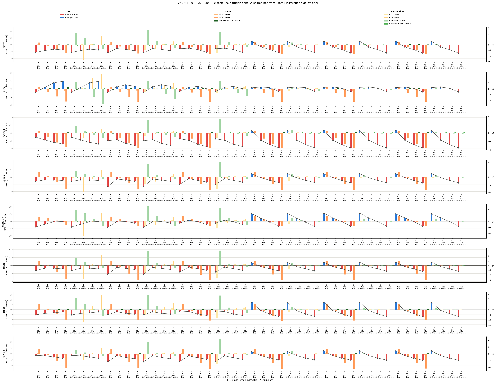
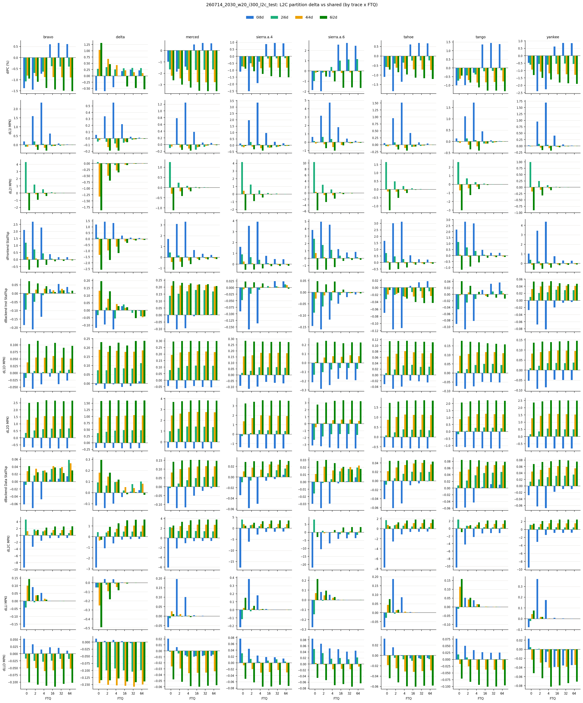
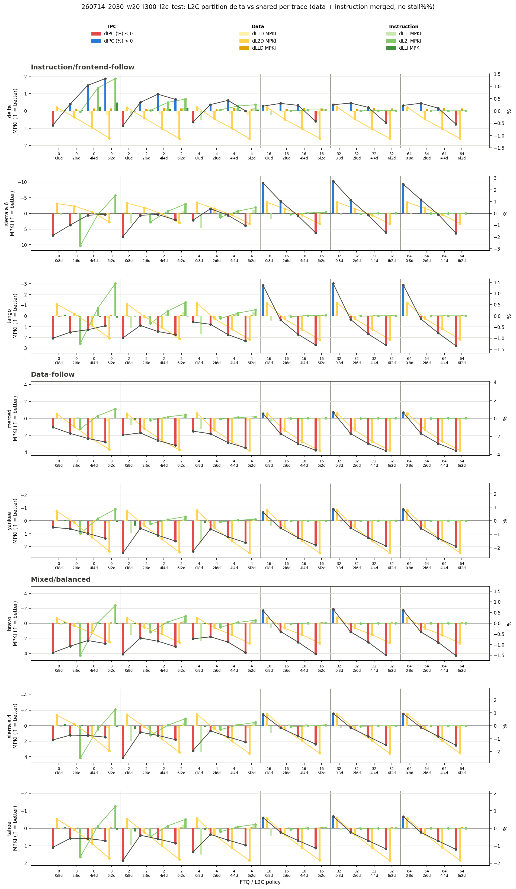

# 2026-07-15 Analysis: 260714 L2C I/D Partition 결과

## 분석 대상

- Run ID: `260714_2030_w20_i300_l2c_partition`
- 목적: L2C를 instruction/data 용도로 나누었을 때, shared L2C 대비 IPC와 cache/stall 지표가 어떻게 변하는지 확인한다.
- 실험 길이: warmup `2,000,000`, simulation `30,000,000`
- L2C 정책:
  - `shared`: 기존 L2C 공유 구조
  - `0i8d`: instruction은 L2C를 사용하지 않고 data가 모든 L2C way 사용
  - `2i6d`, `4i4d`, `6i2d`: instruction/data way partition
- 현재 summary에 포함된 FTQ: `0`, `4`, `32`
- 실행 방식: `-p58` 동시성을 유지하기 위해 FTQ를 2단계로 나눠 순차 실행했다 (stage 1: `-f 0x15`=FTQ `0,4,32`, stage 2: `-f 0x2a`=FTQ `2,16,64`, 같은 run id로 `stage1 && stage2` 형태의 백그라운드 job). 이 문서의 분석은 stage 1이 끝난 시점 데이터 기준이며, 진행 과정은 `docs/exp/2026_07_15_experiment.md`에 자세히 기록했다.

## 현재 데이터 상태

현재 `summary`에는 `fdip_0`, `fdip_4`, `fdip_32`의 모든 L2C 정책에 대한 `metrics.csv`가 생성되어 있다.

raw 로그 기준으로는 `fdip_2/shared`, `fdip_16/shared`도 296개씩 존재하지만, 아직 L2C partition별 summary에는 포함되어 있지 않다. `fdip_64/shared`는 61개만 존재하므로 진행 중이거나 중단된 상태로 보인다.

따라서 현재 분석은 `fdip_0`, `fdip_4`, `fdip_32`와 `shared/0i8d/2i6d/4i4d/6i2d` 조합을 기준으로 한다.

주의할 점:

- `fdip_0/4i4d`에서 `yankee_0012`, `yankee_0054` 두 개가 실패한 상태다.
- 실패 원인은 `PageTableWalker`의 request backlog가 MSHR 제한을 우회해 커지면서 `std::bad_alloc`이 발생한 것으로 확인했다.
- 이 문제는 `ChampSim_FDIP` 커밋 [`f6602de` "Bound PTW MSHR pressure"](https://github.com/seongho-jeong7/ChampSim_FDIP/commit/f6602de0225dac669a712813b6b3a0798576433f)로 반영했다 (active MSHR/finished/completed/next-step 합이 `MSHR_SIZE`를 넘으면 새 upper RQ를 막도록 PTW를 수정, cache/channel dependency vector 병합도 정렬 전제 없이 append→sort→unique로 변경). 다만 지금 도는 실험에 영향이 가지 않도록 이 커밋은 아직 빌드하지 않았고, 현재 결과는 수정 전 binary로 생성된 데이터라서 해당 실패가 남아 있다.
- 재측정 계획: stage 2(FTQ `2,16,64`)까지 완료된 뒤, 수정된 소스로 다시 빌드하고 `fdip_0/4i4d`의 `yankee_0012`/`yankee_0054`를 재실행해 실패가 사라지는지 확인할 예정이다.
- `0i8d`는 L2C instruction hit/miss를 의미상 제거하는 정책이므로, parser에서는 `0i8d`의 L2I MPKI 변화량을 0으로 고정해 비교한다.

## L2C Delta Graph 분석

### `l2c_delta_combined.png` 분석

이 그림은 trace별로 FTQ와 L2C policy를 나누고, data-side 지표와 instruction-side 지표를 나란히 보여준다. 막대는 MPKI 또는 stall 변화량이고, 선은 IPC 변화량이다.

가장 먼저 보이는 패턴은 `0i8d`가 data-side에는 대체로 유리하다는 점이다. `0i8d`에서는 instruction이 L2C를 점유하지 않으므로 L2C 전체 MPKI와 L2D MPKI가 내려가는 경우가 많다. 다만 FTQ가 작을 때는 instruction miss penalty를 충분히 숨기지 못해서 IPC는 오히려 내려간다.

`ftq=32 + 0i8d`에서는 이 패턴이 바뀐다. 대부분의 trace에서 IPC가 shared보다 좋아지고, 특히 `sierra.a.6`, `tango`, `sierra.a.4`, `yankee`, `tahoe`, `merced`, `bravo`가 모두 양의 IPC 변화를 보인다. 이는 instruction을 L2C에서 제거해 data 공간을 보호하는 효과가 있고, FTQ가 충분히 커서 instruction-side latency를 일부 흡수할 수 있을 때 성능 이득으로 연결된다는 해석을 가능하게 한다.

반대로 `6i2d`는 data way를 2개만 남기기 때문에 L2D MPKI 증가가 거의 모든 trace에서 뚜렷하다. 이 증가가 `backend_data_stall_pct` 증가와 함께 나타나는 경우가 많고, IPC도 대부분 나빠진다. 특히 `merced`는 `4i4d`, `6i2d`에서 반복적으로 큰 IPC 손해를 보여 data-side L2C capacity에 민감한 trace로 볼 수 있다.

`2i6d`는 가장 보수적인 partition이라 손해가 상대적으로 작지만, 평균적으로 shared를 이기지는 못한다. 즉 instruction에 2 way를 보장하는 이득보다 data way를 6개로 줄이는 비용이 더 자주 나타난다.

### `l2c_delta_grid.png` 분석

grid 그림은 각 trace를 열로, 각 metric을 행으로 배치해 policy별 변화를 비교하기 좋다. 여기서도 결론은 비슷하다.

- `0i8d`: L2C MPKI가 크게 감소한다. L2D MPKI도 감소하는 경향이 있다. 하지만 `ftq=0`, `ftq=4`에서는 IPC가 대부분 음수이고, `ftq=32`에서만 평균적으로 양수로 전환된다.
- `2i6d`: L2D MPKI는 약간 증가하거나 거의 유지된다. IPC 손해는 비교적 작지만, shared 대비 뚜렷한 이득도 제한적이다.
- `4i4d`: L2D MPKI 증가가 커지고 IPC 손해가 더 자주 보인다.
- `6i2d`: L2D MPKI와 L2C MPKI 증가가 가장 크며, IPC 손해도 가장 크다.

정책별 평균을 보면 이 경향이 더 명확하다.

| FTQ | Policy | Avg IPC 변화 | Avg L2D MPKI 변화 | Avg L2C MPKI 변화 | Avg Backend Data Stall 변화 |
|---:|---|---:|---:|---:|---:|
| 0 | 0i8d | -1.063% | -8.921% | -47.735% | -0.058 |
| 0 | 2i6d | -0.760% | -0.044% | +12.794% | +0.008 |
| 0 | 4i4d | -0.614% | +10.740% | +4.234% | +0.054 |
| 0 | 6i2d | -0.709% | +23.343% | +2.232% | +0.092 |
| 4 | 0i8d | -1.124% | -9.580% | -16.569% | -0.063 |
| 4 | 2i6d | -0.429% | +3.808% | +6.058% | +0.031 |
| 4 | 4i4d | -0.858% | +14.255% | +11.594% | +0.053 |
| 4 | 6i2d | -1.328% | +24.846% | +18.974% | +0.070 |
| 32 | 0i8d | +1.032% | -9.817% | -10.047% | -0.001 |
| 32 | 2i6d | -0.218% | +3.699% | +3.941% | +0.037 |
| 32 | 4i4d | -0.910% | +14.210% | +14.154% | +0.051 |
| 32 | 6i2d | -1.621% | +24.743% | +24.514% | +0.054 |

핵심은 `0i8d`가 data-side cache pressure를 줄이는 데에는 가장 강력하지만, 그 자체만으로는 항상 성능 이득이 되지 않는다는 점이다. instruction-side latency를 충분히 감당할 수 있는 조건, 현재 결과에서는 `ftq=32`, 이 함께 있어야 IPC 개선으로 이어진다.

따라서 다음 실험 방향은 단순히 L2C를 정적으로 나누는 것보다, instruction을 L2C에 넣을지 말지를 FTQ 크기, frontend stall, data pressure에 따라 동적으로 선택하는 정책이 더 가능성이 있어 보인다.

## 0715 Delta Combined Graph 분석

이 그림은 앞의 v1(`l2c_delta_combined.png`)과 같은 데이터에서 stall%p 3개 지표를 빼고, data-side/instruction-side MPKI를 (FTQ, policy) 하나의 그룹에 같이 그린 버전이다. Data는 노랑 계열(L1D→L2D→LLD), instruction은 초록 계열(L1I→L2I→LLI)로 구분되고, dL2I(초록 선)/dL2D(노랑 선) 추세선이 각 FTQ 블록 안에서 policy 변화 경향을 보여준다.

각 trace의 세 번째 블록(`ftq=32`)을 보면 초록 계열(L1I/L2I MPKI) 막대와 dL2I 추세선이 노랑 계열(L1D/L2D MPKI) 막대에 비해 거의 평평하고 0에 붙어 있다. 반면 `ftq=0`/`ftq=4` 블록에서는 초록 막대도 상당한 높이를 보인다. 즉 그림만 봐도 "`ftq=32`에서는 instruction-side MPKI 변화가 시각적으로 거의 안 보인다"는 것이 바로 확인되는데, 아래는 그 이유를 raw 수치로 뜯어본 것이다.

### FTQ=32에서 instruction MPKI delta가 작아 보이는 이유

`ftq=32`에서는 instruction 관련 MPKI 변화가 그림에서 거의 작게 보인다. 가장 큰 이유는 shared 기준의 instruction-side MPKI 자체가 이미 매우 낮기 때문이다.

`ftq=32/shared`의 L2I MPKI는 대부분의 trace에서 `0.01~0.04 MPKI` 수준이고, 상대적으로 높은 `sierra.a.6`도 약 `0.147 MPKI`다. 따라서 L2I MPKI가 퍼센트로는 크게 변해도 raw delta는 매우 작다.

`ftq=32`에서 raw delta 평균:

| Policy | dL1I MPKI | dL2I MPKI | dFrontend Stall | dL2D MPKI | dIPC |
|---|---:|---:|---:|---:|---:|
| 0i8d | +0.1331 | +0.0000 | +0.3318 | -1.1548 | +1.0324% |
| 2i6d | -0.0546 | +0.0298 | +0.0123 | +0.3190 | -0.2176% |
| 4i4d | -0.0460 | -0.0027 | -0.0748 | +1.4780 | -0.9104% |
| 6i2d | -0.0350 | -0.0193 | -0.1532 | +2.6875 | -1.6209% |

여기서 중요한 점은 instruction-side 변화보다 data-side 변화가 훨씬 크다는 것이다. `4i4d`, `6i2d`는 L2I MPKI를 조금 줄이지만, L2D MPKI 증가가 훨씬 커서 IPC는 나빠진다. 즉 `ftq=32`에서는 instruction miss 개선 여지가 작고, L2C partition의 성능 영향은 주로 data capacity를 얼마나 보존하느냐에 의해 결정된다.

`0i8d`는 L2I MPKI delta를 parser에서 0으로 고정해 두었지만, 실제 해석은 “instruction이 L2C를 의미 있게 사용하지 않는다”에 가깝다. 이 경우 L1I MPKI와 frontend stall은 약간 증가하지만, L2D MPKI가 크게 감소하면서 평균 IPC가 좋아진다. 따라서 `ftq=32 + 0i8d`의 이득은 instruction MPKI 개선이 아니라 data-side L2C pressure 감소가 핵심으로 보인다.

### Case Study: `merced`, `ftq=0`, `0i8d`

이 사례도 위 `l2c_delta_combined_v2.png`에서 확인할 수 있다: `merced` 행의 첫 번째 블록(`ftq=0`)에서 `0i8d` 막대를 보면, 노랑 계열(L2D MPKI)은 위(개선, MPKI 축이 반전되어 있음)를 향하는데 dIPC(빨강)는 shared보다 나쁜 쪽(아래)에 있다 -- data MPKI 개선과 IPC 악화가 동시에 나타나는 것이 그림에서부터 보이는 지점이다.

`merced/ftq0/0i8d`는 data MPKI가 좋아졌는데도 IPC가 감소한 대표 사례다.

shared 대비 변화:

| Metric | shared | 0i8d | 변화 |
|---|---:|---:|---:|
| IPC | 0.5287 | 0.5234 | -0.988% |
| L1I MPKI | 13.8221 | 13.8179 | -0.0042 |
| L2I MPKI | 5.5833 | 0.0000 | parser상 0 고정 |
| Frontend instruction fetch stall | 24.0286 | 25.7334 | +1.7048 |
| L1D MPKI | 17.1530 | 17.1082 | -0.0447 |
| L2D MPKI | 7.5697 | 7.0362 | -0.5335 |
| Backend data stall | 1.9488 | 1.8551 | -0.0937 |
| L2C MPKI | 13.1531 | 7.0362 | -6.1168 |
| LLD MPKI | 5.7749 | 5.7955 | +0.0206 |

data-side만 보면 `0i8d`가 좋아진다. L2D MPKI가 약 `0.53` 줄고, backend data stall도 약 `0.09` 낮아진다. 하지만 이 이득보다 frontend 손해가 더 크다. frontend instruction fetch stall이 약 `1.70` 증가하면서 IPC가 약 `0.99%` 감소한다.

이 결과는 `ftq=0`에서는 instruction-side latency를 숨길 장치가 없다는 점과 연결된다. `0i8d`는 instruction이 L2C를 점유하지 않게 만들어 data 공간을 보호하지만, L1I miss가 났을 때 instruction이 L2C에서 빨리 해결될 기회를 잃는다. 현재 구현도 완전한 wire bypass가 아니라 L2C path를 거쳐 lower level로 내려가는 형태이므로, 통계상 L2I MPKI는 0으로 처리되더라도 frontend stall에는 instruction fetch 지연이 반영된다.

따라서 `merced/ftq0/0i8d`의 결론은 다음과 같다.

- data-side 압력은 줄었다.
- 하지만 `ftq=0`에서는 instruction miss latency를 숨기지 못했다.
- frontend stall 증가폭이 data stall 감소폭보다 커서 IPC가 감소했다.

즉 `0i8d`는 FTQ가 충분히 커서 instruction fetch 지연을 가릴 수 있을 때만 좋은 방향으로 작동한다.

### MPKI의 경향과 IPC 경향의 불일치에 대한 분석

`0i8d`에서 data MPKI가 개선되고 instruction MPKI가 거의 동일하게 보이더라도 IPC가 감소할 수 있다. 이유는 MPKI는 miss의 "개수"를 보여주지만, 각 miss가 처리되는 "latency"를 직접 보여주지는 않기 때문이다.

`0i8d`에서는 instruction이 L2C를 사용하지 않으므로 L1I miss가 발생했을 때 L2C hit로 빠르게 해결되는 경로가 약해진다. 따라서 instruction miss 개수는 비슷해 보여도, miss 1개당 frontend가 기다리는 시간이 길어질 수 있다. `merced/ftq0/0i8d`에서 L1I MPKI는 거의 변하지 않았지만 frontend instruction fetch stall이 증가한 것이 이 해석과 맞는다.

반대로 `ftq=32`에서는 FTQ가 미래 instruction fetch를 더 잘 준비하므로 instruction-side miss latency가 IPC에 직접 드러나는 정도가 줄어든다. 이 경우 instruction MPKI 변화는 작고, IPC는 data-side 변화, 특히 L2D/L2C MPKI 변화의 경향을 더 잘 따라간다.

정리하면:

- `ftq=0`: instruction miss latency가 그대로 frontend stall로 나타나므로, data MPKI 개선만으로 IPC 개선을 보장하지 못한다.
- `ftq=32`: instruction fetch 지연이 상당 부분 가려지므로, data-side L2C pressure 감소가 IPC 개선으로 연결되기 쉽다.
- 따라서 `0i8d`의 효과는 "instruction miss 개수"보다 "instruction miss latency를 FTQ가 얼마나 숨길 수 있는가"에 크게 의존한다.

## FTQ=0 Workload 분류: instruction-follow vs data-follow

`ftq=32`에서는 instruction-side miss latency가 FTQ에 의해 상당히 가려지기 때문에 IPC가 data-side MPKI 경향을 더 잘 따라간다. 반면 `ftq=0`에서는 FTQ가 없으므로 workload에 따라 IPC가 instruction-side 지표를 따라가기도 하고 data-side 지표를 따라가기도 한다.

여기서는 `ftq=0`에서 L2C policy를 바꾸었을 때, IPC가 어떤 지표의 개선 방향을 더 따라가는지 기준으로 workload를 나눴다.

| 분류 | Workload | 판단 근거 |
|---|---|---|
| Instruction/frontend-follow | `delta`, `sierra.a.6`, `tango` | frontend instruction fetch stall이 줄어드는 `6i2d`가 가장 좋은 IPC를 보인다. data MPKI는 나빠져도 IPC가 개선되거나 손해가 줄어든다. |
| Data-follow | `merced`, `yankee` | data MPKI와 backend data stall을 줄이는 `0i8d`가 partition 중 가장 좋은 IPC를 보인다. frontend stall은 나빠져도 data-side 이득이 더 중요하게 작용한다. |
| Mixed/balanced | `bravo`, `sierra.a.4`, `tahoe` | 한쪽 지표만으로 설명되지 않는다. `0i8d`는 data를 보호하지만 frontend 손해가 크고, `6i2d`는 frontend를 줄이지만 data 손해가 크다. 중간 partition이 상대적으로 낫다. |

### Instruction/frontend-follow 그룹

이 그룹에서는 data MPKI가 나빠져도 frontend stall이 줄어들면 IPC가 좋아진다. 즉 `ftq=0`에서는 instruction fetch 지연이 주요 병목에 가깝다.

대표 예:

| Trace | Best policy | dIPC | dFrontend Stall | dL2D MPKI | dBackend Data Stall |
|---|---|---:|---:|---:|---:|
| delta | 6i2d | +1.311% | -2.579 | +1.582 | +0.295 |
| sierra.a.6 | 6i2d | -0.087% | -1.576 | +2.754 | +0.029 |
| tango | 6i2d | -0.442% | -1.190 | +2.074 | +0.084 |

`delta`는 가장 선명하다. `6i2d`에서 L2D MPKI와 backend data stall은 나빠지지만, frontend stall 감소가 훨씬 커서 IPC가 `+1.311%` 개선된다.

`sierra.a.6`와 `tango`는 shared 대비 IPC가 완전히 좋아지지는 않지만, partition 중에서는 `6i2d`가 가장 낫다. 즉 이 둘도 `ftq=0`에서는 data 보호보다 frontend stall 감소가 더 중요하게 작용한다.

### Data-follow 그룹

이 그룹에서는 frontend stall이 증가하더라도 data-side 지표가 좋아지는 `0i8d`가 가장 낫다. 즉 data capacity pressure가 더 중요한 병목이다.

대표 예:

| Trace | Best policy | dIPC | dFrontend Stall | dL2D MPKI | dBackend Data Stall |
|---|---|---:|---:|---:|---:|
| merced | 0i8d | -0.988% | +1.705 | -0.533 | -0.094 |
| yankee | 0i8d | -0.482% | +1.035 | -0.752 | -0.028 |

`merced`와 `yankee` 모두 `0i8d`에서 frontend stall은 증가한다. 하지만 L2D MPKI와 backend data stall이 줄어들기 때문에 다른 partition보다 IPC 손해가 작다. 특히 `6i2d`처럼 data way를 강하게 줄이면 두 workload 모두 IPC가 더 크게 나빠진다.

### Mixed/balanced 그룹

이 그룹은 instruction-side와 data-side가 모두 중요해서 한쪽으로 밀어붙이면 손해가 생긴다.

대표 예:

| Trace | Best policy | dIPC | dFrontend Stall | dL2D MPKI | dBackend Data Stall |
|---|---|---:|---:|---:|---:|
| bravo | 4i4d | -0.808% | +0.188 | +1.294 | +0.028 |
| sierra.a.4 | 2i6d | -0.728% | +0.899 | -0.201 | -0.010 |
| tahoe | 2i6d | -0.576% | +0.725 | +0.086 | -0.009 |

`bravo`는 `0i8d`에서 data-side는 좋아지지만 frontend stall이 크게 증가해 IPC가 가장 나쁘다. 반대로 `6i2d`는 frontend stall을 줄이지만 data-side 손해가 커진다. 그래서 중간에 가까운 `4i4d`가 가장 낫다.

`sierra.a.4`와 `tahoe`는 `2i6d`가 가장 낫다. 이는 instruction에 약간의 L2C 공간을 보장하면서도 data way를 크게 줄이지 않는 지점이 더 안정적이라는 뜻이다.

### 현재 가설

`ftq=0`에서는 workload를 다음과 같이 볼 수 있다.

- frontend 병목이 강한 workload는 instruction L2C 공간을 늘리거나 instruction miss latency를 줄이는 방향이 유리하다.
- data capacity pressure가 강한 workload는 instruction을 L2C에서 줄이거나 제거해 data 공간을 보호하는 방향이 유리하다.
- mixed workload는 static partition 하나로 최적화하기 어렵고, frontend stall과 data-side pressure를 함께 보는 동적 정책이 필요하다.

따라서 이후 정책은 단순히 `0i8d` 또는 `6i2d` 중 하나를 고정하는 것보다, workload의 현재 phase가 frontend-follow인지 data-follow인지 판단해 instruction의 L2C 사용량을 조절하는 방향이 좋아 보인다.

## Code modeling note

L2C way partition과 hit latency 모델은 별도 code analysis 문서에 정리한다.

- [2026-07-15 Code Analysis: L2C Way Partition과 Latency 모델](2026_07_15_code_analysis.md)
