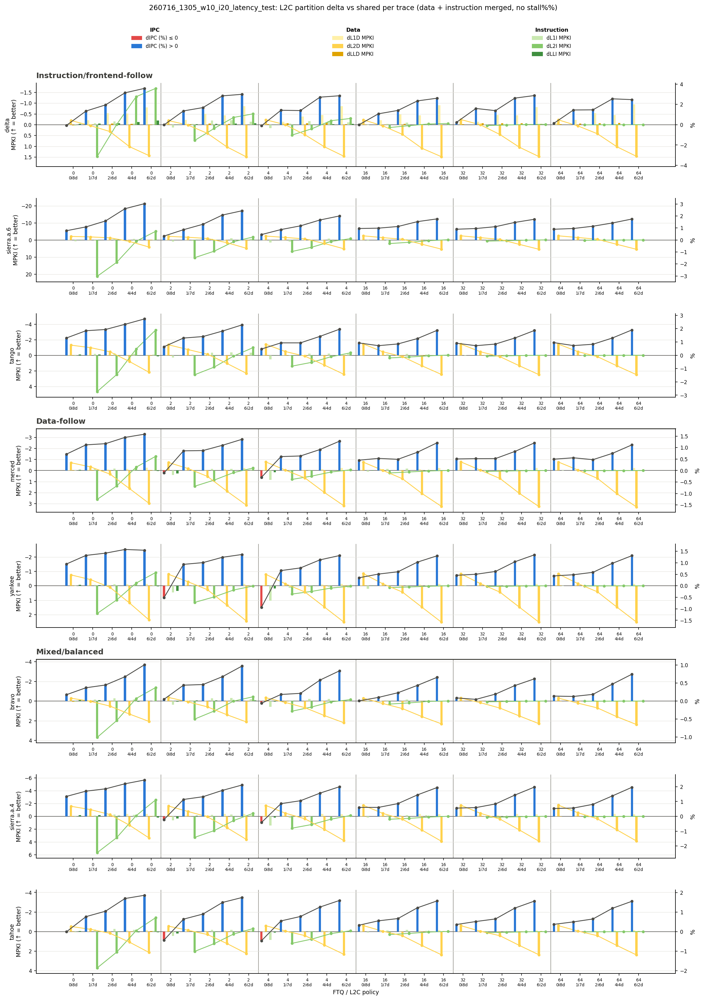

# 2026-07-16 Analysis: `latency_test` (6-FTQ 전체) vs `260714_2030` 비교

이 문서는 `260716_1305_w10_i20_latency_test`(6개 FTQ 전체, stage 1+2 완료) 결과를 `l2c_delta_combined_v2.png` 중심으로 분석하고, 직전 run인 `260714_2030_w20_i300_l2c_partition`와 비교한다. 처음엔 stage 1(FTQ `0`/`4`/`32`)만으로 1차 작성했다가, stage 2(FTQ `2`/`16`/`64`)가 끝나 이번에 6-FTQ 전체 기준으로 갱신했다.

## 분석 대상

- Run ID: `260716_1305_w10_i20_latency_test`, **6개 FTQ 전체**(`0`/`2`/`4`/`16`/`32`/`64`).
- ChampSim_FDIP: 이 run 실행 당시 HEAD(`c19adac` "Model L2C lookup latency by partition", `f6602de` PTW fix 포함).
- 실험 길이: warmup `1,000,000`, simulation `2,000,000` — `260714_2030`(warmup `2,000,000`/simulation `30,000,000`)보다 훨씬 짧은 스모크 테스트.
- L2C 정책: `8i0d`는 이 run에서 100%(1,776/1,776) assertion 실패로 제외(원인은 파악돼서 커밋 `15d240d`로 수정 완료, 별도로 `-p2`로 재실행 중 — `docs/exp/2026_07_16_experiment.md` 참고). 아래 비교는 **`shared`/`0i8d`/`2i6d`/`4i4d`/`6i2d`** 4개(두 run 공통) 기준이며, `1i7d`(신규 정책, `260714_2030`엔 없음)는 별도로만 언급한다.
- `260716_1305`는 이제 6-FTQ 스모크 테스트로서 목적을 다했고, 같은 조건(`8i0d` 포함 7정책)을 `260714_2030`과 같은 길이(`w20`/`i300`)로 재현하는 `260716_1733_w20_i300_latency_test`가 별도로 진행 중이다.

## `l2c_delta_combined_v2.png`

워크로드 3분류(Instruction/frontend-follow, Data-follow, Mixed/balanced, `docs/exp/2026_07_15_analysis.md` 기준)로 정렬돼 있다. 이제 각 trace 행마다 FTQ 6개(`0`/`2`/`4`/`16`/`32`/`64`) 블록이 전부 나온다.

**첫눈에 드는 인상이 `260714_2030`과 완전히 다르다**: `260714_2030`의 v2 그림(`docs/exp/2026_07_15_analysis.md`)은 대부분 빨간(dIPC ≤ 0) 막대였고 `ftq=32 + 0i8d` 정도만 파란색이었는데, 이 그림은 **거의 전부 파란색(dIPC > 0)** 이다. 빨간 막대는 14개뿐이고 전부 `0i8d`에 몰려 있는데, FTQ가 커질수록(`16` 이상) 빨간 막대가 사라진다 — `ftq=32`/`64`에서는 `0i8d`도 전부 파란색이다.

## 정량 비교: dIPC 부호와 평균

6개 FTQ 전체(`0`/`2`/`4`/`16`/`32`/`64`), 공통 4개 정책(`0i8d`/`2i6d`/`4i4d`/`6i2d`) x 8 trace = 192개 조합 기준.

| | dIPC > 0 | dIPC ≤ 0 | 평균 dIPC |
|---|---:|---:|---:|
| `260714_2030` (구 코드) | 42 / 192 (22%) | 150 / 192 | **-0.68%** |
| `260716` (최신 코드) | 178 / 192 (93%) | 14 / 192 | **+1.13%** |

정책별 평균 dIPC:

| Policy | `260714_2030` | `260716` | 변화 |
|---|---:|---:|---:|
| `0i8d` | -0.161% | +0.316% | +0.48%p |
| `2i6d` | -0.392% | +0.957% | +1.35%p |
| `4i4d` | -0.824% | +1.467% | +2.29%p |
| `6i2d` | -1.326% | +1.789% | +3.12%p |
| `1i7d`(신규) | — | +0.815% | — |

4개 정책 전부 부호가 뒤집혔고, way를 더 극단적으로 나눌수록(→ `6i2d`) 개선폭이 더 커지는 경향도 새로 생겼다(구 코드에서는 반대로 `6i2d`가 가장 나빴다). Stage 1만 봤을 때(3-FTQ, 96쌍)와 수치가 거의 같아서(92%→93%, +1.19%→+1.13%) FTQ `2`/`16`/`64`가 추가돼도 결론은 그대로 유지된다.

## MPKI 경향은 거의 그대로 — capacity trade-off 자체는 안 바뀌었다

dIPC는 완전히 뒤집혔지만, 같은 정책의 `dL2D MPKI`/`dL2I MPKI` 평균은 두 run에서 거의 같다(6-FTQ 전체 기준):

| Policy | dL2D MPKI (구) | dL2D MPKI (신) | dL2I MPKI (구) | dL2I MPKI (신) |
|---|---:|---:|---:|---:|
| `0i8d` | -1.112 | -1.009 | 0.000 | 0.000 |
| `2i6d` | +0.220 | +0.243 | +0.748 | +1.084 |
| `4i4d` | +1.377 | +1.539 | -0.128 | +0.054 |
| `6i2d` | +2.641 | +2.853 | -0.655 | -0.511 |

4개 정책 전부 부호와 크기가 거의 동일하다(`0i8d`의 dL2D도 stage-1-only 때와 달리 이제 두 run이 같은 부호로 일치한다 — 6-FTQ 전체로 평균을 내니 짧은 실행 길이 때문에 생겼던 노이즈가 줄어든 것으로 보인다). 즉 **way를 나눴을 때 어느 쪽 MPKI가 늘고 주는지는 예전과 같은데, 그게 IPC로 이어지는 방식이 바뀌었다** — 이건 capacity 모델이 아니라 latency 모델이 바뀌었다는 뜻이다.

## 왜 뒤집혔나: way 기반 search latency 모델

`docs/exp/2026_07_15_code_analysis.md`에 정리된 대로, `c19adac`는 L2C search latency를 "고정 8 cycle"에서 "**할당된 way 수만큼 1 cycle/way**"로 바꿨다.

| Policy | Instruction search latency | Data search latency |
|---|---:|---:|
| shared | 8 cycles | 8 cycles |
| `0i8d` | 0 (L2C bypass) | 8 cycles |
| `2i6d` | 2 cycles | 6 cycles |
| `4i4d` | 4 cycles | 4 cycles |
| `6i2d` | 6 cycles | 2 cycles |

instruction+data way 합이 항상 8(shared의 전체 way 수)이므로, **어떤 static partition을 쓰든 양쪽 다 shared의 8-cycle보다 search latency가 줄어든다** — 이게 이전 모델에는 없던 효과다. 그리고 이 latency 절감은 hit/miss와 무관하게 **모든 접근**에 적용되는 반면, MPKI 악화로 인한 손해는 **miss가 난 일부 접근**에만 적용된다. 그래서 접근 빈도가 높은 쪽의 search latency를 크게 줄이는 정책(`6i2d`: data search 8→2 cycle)이, 그로 인한 capacity 손해(`6i2d`의 data MPKI 증가가 가장 큼)를 상쇄하고도 남는 것으로 보인다.

이게 사실이라면 `6i2d`가 모든 trace에서 최고 정책이 된 것도 설명된다(6-FTQ 전체 평균 기준):

| Trace | `260714_2030` 최고 정책 | dIPC | `260716` 최고 정책 | dIPC |
|---|---|---:|---|---:|
| bravo | 0i8d | -0.28% | **6i2d** | +0.81% |
| delta | 4i4d | +0.44% | **6i2d** | +2.90% |
| merced | 0i8d | -0.40% | **6i2d** | +1.29% |
| sierra.a.4 | 2i6d | -0.35% | **6i2d** | +2.07% |
| sierra.a.6 | 0i8d | +0.56% | **6i2d** | +2.12% |
| tahoe | 2i6d | -0.34% | **6i2d** | +1.65% |
| tango | 0i8d | +0.32% | **6i2d** | +2.10% |
| yankee | 0i8d | -0.47% | **6i2d** | +1.36% |

구 코드에서는 trace마다 최고 정책이 갈렸는데(워크로드 분류 근거였다), 신 코드에서는 **8개 trace 전부 `6i2d`가 1등**이다(stage-1-only 때도 마찬가지였고, FTQ `2`/`16`/`64`를 더해도 안 바뀐다). Search latency 모델이 지배적인 요인이 되면서, 워크로드별 성격 차이(instruction-follow/data-follow/mixed)보다 "data search latency를 최대한 줄이는 정책이 이긴다"는 단일 효과가 더 크게 작용하는 것으로 보인다.

## 토론: shared는 왜 8-way를 전부 뒤져야 하는가, LRU/SRRIP는 왜 origin을 구분하지 않는가

이 결과를 보고 나온 질문: "shared가 양쪽 다 8 cycle인 게 너무 불리한 가정 아닌가? 실제로는 instruction/data가 특정 way에 몰려서 평균 4 cycle 정도로 끝나지 않을까?"

**요청이 instruction인지 data인지 판별하는 건 어렵지 않다.** 이 repo에는 이미 `is_instr_fetch` 플래그가 있어서 L1I miss가 L2C/LLC까지 그대로 전달된다(이번 실험 전체가 이 메커니즘 위에 있다). 문제는 "지금 요청이 뭔지"가 아니라 **"찾는 라인이 그 set의 어느 way에 들어있는지"** 다.

Shared 캐시에서 이 위치를 예측할 수 없는 이유는 **LRU/SRRIP 같은 표준 replacement policy가 origin을 보지 않고 way를 고르기 때문**이다. 여기엔 설계상 이유가 있다:

- **Adaptive capacity allocation**: origin-blind 상태로 두면, 그 순간 재사용(reuse)이 많은 쪽이 자연스럽게 더 많은 way를 차지하게 된다. Instruction-heavy phase에는 instruction 라인이, data-heavy phase에는 data 라인이 알아서 더 많이 살아남는다 — 고정 quota 없이 수요에 따라 capacity가 움직인다. 이게 shared/unified 캐시가 애초에 존재하는 이유이자 이론적 장점이다.
- **정적 편향의 starvation 위험 회피**: 만약 replacement가 origin을 알고 "항상 data를 먼저 쫓아낸다" 같은 규칙을 넣으면, 실제로 그 순간 data 재사용이 훨씬 중요한 phase에서도 data가 손해를 본다. `6i2d`가 지금 보여주는 것과 정확히 같은 종류의 위험이다 — data에 2 way만 주면 data MPKI가 확실히 늘어난다(위 MPKI 표 참고). LRU/SRRIP는 "관찰된 재사용 패턴"만 근거로 삼아서 이런 하드코딩된 편향을 피한다.
- **구현 단순성**: origin별로 way를 추적/편향하려면 line마다 origin 태그, insertion/promotion 규칙 추가가 필요하다. 전통적으로 recency/frequency가 1차 신호이고 origin은 2차적인 요인으로 취급돼 온 것도 있다.

즉 origin을 구분하지 않는 건 "판별이 어려워서"가 아니라 **"적응형 공유"라는 shared 캐시의 설계 목표 자체가 origin-blind를 요구하기 때문**이다. static partition(`2i6d`, `4i4d`, `6i2d`...)은 이 적응성을 포기하는 대신, 정확히 그 포기 덕분에 "어느 way를 봐야 하는지 미리 안다"는 이점(=이번 실험에서는 search latency 절감)을 얻는다.

이 관점에서 보면 이번 결과가 왜 나왔는지도 다시 정리된다: **원래 ChampSim baseline(latency 모델 없음)에서는 적응형 shared가 이기거나 비슷한 게 일반적인 캐시 연구 상식과 맞다** — capacity를 유연하게 나눠 쓰는 이점이 온전히 남기 때문이다. 그런데 이번 `c19adac` 모델은 "way 수에 비례한 search latency"라는 새 비용을 shared에게만 최대치(8 cycle 양쪽 다)로 부과하면서, static partition의 "미리 알고 찾는" 이점을 capacity 손해보다 훨씬 크게 만들어버렸다. 그래서 `6i2d`처럼 원래는 capacity 손해가 커서 나쁜 정책으로 꼽히던 것이 오히려 1등으로 뒤집힌 것으로 보인다.

### 왜 역사적으로 L1은 분리, L2 이하는 unified로 갔는가

같은 맥락에서 나온 질문: "옛날엔 I/D가 분리돼 있었는데 왜 shared로 넘어왔나?"

- **L1이 분리된 진짜 이유는 대역폭이다.** 파이프라인은 매 사이클 instruction fetch와 data load/store를 동시에 해야 하는데, 캐시가 하나면 포트 경합이 매 사이클 생긴다. L1을 쪼개면 물리적으로 별도 포트가 생겨서 이 경합이 사라진다. L1은 파이프라인과 타이밍이 딱 붙어있어(1~4 cycle) 이게 특히 중요했다.
- **L2로 내려가면 그 압박이 사라진다.** L2는 L1I/L1D가 둘 다 놓친 것만 보므로 요청 빈도가 훨씬 낮다. 매 사이클 포트 경합을 걱정할 필요가 없어지면서, 분리해서 얻던 대역폭 이점이 L2에서는 거의 사라진다.
- **반대로 분리 비용은 캐시가 커질수록 더 아파진다.** 크고 비싼 SRAM을 instruction/data용으로 미리 반씩 고정해두면, 워크로드마다 I/D 비중이 다른데 한쪽이 남아돌아도 다른 쪽이 못 쓴다. Unified로 합치면 그 순간 압박이 큰 쪽이 자연스럽게 더 많이 쓰는 적응형 배분이 되고, 같은 트랜지스터 예산으로 더 나은 hit rate를 얻는다 — 캐시가 클수록 이 효과가 절대적으로 커진다.
- **Latency 여유도 늘어난다.** L1은 몇 cycle이라 검색 범위가 넓어지는 비용이 치명적이지만, L2/L3는 이미 수십 cycle이라 상대적 부담이 작다.
- 실제로도 초기 RISC 파이프라인(MIPS류)은 L1만 Harvard식으로 쪼갰고, L2부터는 Intel P6(Pentium Pro, 1995년경) 이후로 unified가 사실상 업계 표준이 됐다.

즉 지금 실험에서 shared L2가 origin-blind인 것도 이 역사적 흐름(L2 이하는 적응형 unified가 유리하다는 통념)을 그대로 따르고 있고, `c19adac`의 latency 모델이 이 통념을 뒤집을 만큼 강한 가정(shared = 양쪽 다 최대 8 cycle)을 넣었다는 게 지금 결과의 핵심이다.

### 다음 아이디어: 하드웨어는 안 쪼개고 replacement policy로 실시간 비율 조정

이어서 나온 제안: "하드웨어(way 구조)는 고정하지 말고, replacement policy가 실시간으로 instruction/data 비율을 조정하면서, 그 순간 할당된 way 수만큼만 search latency를 부과하면 어떨까?"

이건 이론적으로 **적응형 capacity 배분(shared의 장점)과 "아는 way만 검색"(static partition의 장점)을 동시에 가져가는 하이브리드**라 방향은 합당하다. 실제로 이런 연구가 이미 있다.

**참고 논문: Utility-Based Cache Partitioning (Qureshi & Patt, MICRO 2006)**

- **문제의식**: shared LLC를 여러 코어/애플리케이션이 나눠 쓸 때, LRU는 각 애플리케이션이 캐시를 실제로 얼마나 "잘 활용하는지(utility)"가 아니라 "얼마나 자주 접근하는지(demand)"에 비례해서 공간을 나눠준다. streaming처럼 접근은 잦지만 재사용은 적은 애플리케이션이 LRU 하에서 capacity를 많이 차지해버리고, way를 더 줘도 miss가 확 줄어드는(=utility가 높은) 다른 애플리케이션은 오히려 손해를 본다.
- **메커니즘**: 애플리케이션마다 **Utility Monitor(UMON)** 라는 가벼운 shadow tag 구조(auxiliary tag directory)를 둬서, "이 애플리케이션에 way를 0개~N개 줬을 때 각각 miss가 얼마나 나는지" 곡선을 실시간으로 추정한다. 전체 set을 다 감시하지 않고 일부만 샘플링(dynamic set sampling)해서 오버헤드를 줄인다. 이 utility 곡선들을 보고, 전체 miss를 최소화하도록 way를 배분하는 저비용 greedy 알고리즘("Lookahead algorithm")을 주기적으로(수백만 cycle마다) 돌려서 목표 way 수를 갱신한다. 실제 강제는 replacement/victim 선택을 이 목표치 쪽으로 편향시키는 방식이라, 구조적으로 way를 딱 자르는 게 아니라 **점진적으로 수렴**한다.
- **실험**: 2-core(및 일부 4-core) CMP 시뮬레이터에 SPEC CPU2000 벤치마크 조합을 돌려서, UCP를 LRU-shared 및 static-equal partition과 비교했다. UCP가 두 baseline보다 처리량(weighted speedup 등)이 뚜렷하게 좋았고, 특히 애플리케이션 조합에 따라 개선폭 차이가 컸다(utility 곡선이 서로 다른 조합일수록 UCP 이득이 컸다). UMON 오버헤드는 dynamic set sampling 덕분에 전체 캐시 면적 대비 작다고 보고했다.
- (정확한 수치는 이 문서에서 재확인 없이 기억에 의존한 것이므로, 실제로 이 방향을 설계에 반영하기 전에 원문을 다시 확인해야 한다.)

**이번 실험 맥락에 적용할 때 걸리는 점**:

1. UCP는 "코어/애플리케이션"을 기준으로 partition했지만 지금은 "instruction/data origin" 기준이라 utility 신호를 어떻게 측정할지 다시 정의해야 한다.
2. 비율이 바뀌는 순간의 처리가 애매하다 — 예를 들어 instruction이 way를 하나 더 가져가면 그 way에 있던 기존 data 라인은 어떻게 되는지, 그리고 latency 계산 기준 시점("지금 이 순간 instruction이 정확히 몇 way를 갖고 있는지")을 명확히 정해야 한다.
3. 더 근본적으로, "way 수에 선형 비례하는 search latency"라는 지금 비용 함수 자체가 이미 단순화다(`docs/exp/2026_07_15_code_analysis.md`: "tag 비교는 병렬로 수행될 수 있어서 8-way→16-way가 정확히 2배 latency는 아니다"). 비율을 동적으로 만드는 것과 별개로 이 비용 함수의 현실성은 따로 검증이 필요하다.
4. 구현 스코프가 지금까지의 static config 비교 실험보다 훨씬 크다 — UMON 비슷한 모니터링 로직과 주기적 재분배 알고리즘을 실제로 만들어야 한다.

**정책을 어떻게 구현할지는 아직 미정이다 — 나중에 따로 검토한다.** 지금은 아이디어와 참고 사례만 기록해둔다.

## 남은 14개 예외: `0i8d` + 작거나 중간인 FTQ

유일하게 여전히 손해인 케이스는 전부 `0i8d`(instruction이 L2C를 완전히 bypass)이고, `ftq=0`/`2`/`4`/`16`에 흩어져 있다(`ftq=32`, `64`에서는 `0i8d`도 전부 양수). Stage-1-only 때는 예외가 `ftq=0`/`4`에만 있었는데, `ftq=2`/`16`을 더해보니 `2`에 5건이 새로 몰렸고(`delta`/`merced`/`sierra.a.4`/`tahoe`/`yankee`), `16`에도 `delta` 1건이 아주 작은 음수(-0.006%)로 남아있다 — 그래도 `32` 이상에서는 완전히 사라진다는 결론은 그대로다. 이건 `260714_2030` 분석에서 이미 나온 가설과 일치한다 — `0i8d`는 instruction miss latency를 FTQ가 충분히 가려줄 때(대략 `32` 이상)만 유리하고, FTQ가 작거나 중간이면 L2C bypass로 인한 instruction-side 손해가 아직 다 가려지지 않는다. Search latency 모델이 바뀌어도 이 구조적 이유는 그대로 남아있는 것으로 보인다.

## 비교의 한계

이번 비교는 코드(구 vs 최신 HEAD)와 실행 길이(`w20/i300` vs `w10/i20`)가 동시에 다르다는 caveat가 있다. 다만 두 run의 `dL2D`/`dL2I MPKI` 평균이 거의 동일하다는 점(위 표)이, 이 flip이 "실행 길이가 짧아져서 생긴 우연"이 아니라 "latency 모델 변경 자체의 효과"라는 근거가 된다 — capacity/miss-rate 쪽 지표가 안 변했는데 IPC만 뒤집혔기 때문이다.

**(해소됨, 2026-07-21)** `260716_1733_w20_i300_latency_test`가 `260714_2030`과 완전히 같은 길이로 100% 완료됐고, `docs/exp/2026_07_21_analysis.md`에서 이 caveat 없이 같은 비교를 재확인했다 — 결과는 오히려 더 강하게 나왔다(평균 dIPC +1.13% → +1.47%). 그 문서에는 `8i0d`(이번에 처음 포함된 정책)까지 포함한 심층 분석도 있다.

## 다음 계획

- (완료) stage 2(FTQ `2`/`16`/`64`)까지 포함한 6-FTQ 전체로 이 분석을 갱신함 — 결론(dIPC flip, MPKI 불변, `6i2d` 전 trace 1위)은 stage-1-only 때와 거의 동일하게 유지됨.
- (완료) `8i0d` assertion 원인 파악(`docs/exp/2026_07_16_experiment.md` 참고) 및 수정 커밋(`15d240d`) 반영. `-p2`로 재실행 중 — 끝나면 `260716_1305`도 7개 정책 전체 그림으로 완성한다.
- `260716_1733_w20_i300_latency_test`(같은 길이/조건, `8i0d` 포함 7정책, 진행 중)가 끝나면 실행 길이 caveat 없이 이 비교를 다시 검증한다.
- `6i2d`가 모든 trace에서 1등인 게 이 8-way L2C 크기·설정에 국한된 결과인지, 아니면 더 일반적인 패턴인지 확인하려면 다른 L2C 크기/way 조합도 필요해 보인다(추후 논의).
- "토론" 절에서 나온 동적(UCP 스타일) partitioning 아이디어는 구현 방법 미정 상태로 보류 중.
