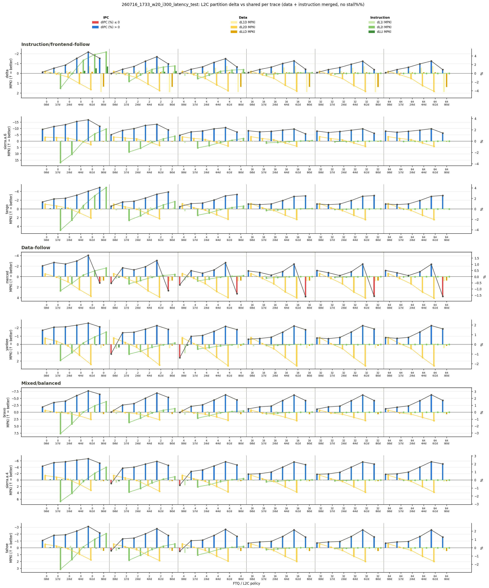

# 2026-07-21 Analysis: `260716_1733_w20_i300_latency_test` 결과 분석

이 문서는 `260716_1733_w20_i300_latency_test`(7개 L2C 정책 x 6개 FTQ, **12,432/12,432 100% 완료**) 결과를 분석한다. `docs/exp/2026_07_16_analysis.md`(0716 Anal.)가 `260716_1305_w10_i20_latency_test`라는 짧은 스모크 테스트 기반이었던 것과 달리, 이 run은 `260714_2030_w20_i300_l2c_partition`와 **완전히 같은 길이**(`w=2,000,000`/`i=30,000,000`)라서 실행 길이 차이라는 caveat 없이 latency 모델링 효과를 비교할 수 있는 첫 run이다.

## 분석 대상

- Run ID: `260716_1733_w20_i300_latency_test`, 6개 FTQ 전체(`0`/`2`/`4`/`16`/`32`/`64`).
- ChampSim_FDIP: HEAD `df0f567`("Fix PTW MSHR completion move") 기준. 이전까지 나온 수정 전부 포함 — `f6602de`(PTW MSHR pressure), `c19adac`(L2C lookup latency by partition), `15d240d`(L2C bypass response handling), `df0f567`(PTW MSHR completion move, `yankee`/`sierra.a.4` 반복 재발 실패의 최종 수정).
- L2C 정책: **7개 전부**(`shared`/`0i8d`/`1i7d`/`2i6d`/`4i4d`/`6i2d`/`8i0d`) — `8i0d`(instruction 8 way / data 0 way)가 이번에 처음으로 완전한 데이터를 갖췄다.
- 원래 stage 1(7건)/stage 2(3건) 실패했던 trace 10개는 `df0f567` 적용 후 전부 재실행해서 성공시켰다(`docs/exp/2026_07_16_experiment.md`의 07-20/07-21 절 참고) — **이 summary에는 결측이 하나도 없다.**
- 비교 대상: `260714_2030_w20_i300_l2c_partition`(latency 모델 이전 코드, 같은 길이, `shared`/`0i8d`/`2i6d`/`4i4d`/`6i2d` 5정책).

## `l2c_delta_combined_v2.png`



워크로드 3분류(Instruction/frontend-follow, Data-follow, Mixed/balanced)로 정렬돼 있고, 이제 각 FTQ 블록마다 정책 6개(`0i8d`~`8i0d`)가 전부 나온다. 전체적으로 파란(dIPC>0) 막대가 압도적이지만, **`merced` 행에서만 매 FTQ 블록의 마지막(`8i0d`) 칸이 빨갛다** — 뒤에서 자세히 다룬다.

## 정량 비교: `260714_2030`과 완전히 같은 길이로 검증

공통 4개 정책(`0i8d`/`2i6d`/`4i4d`/`6i2d`) x 6 FTQ x 8 trace = 192개 조합. 이번엔 두 run의 `w`/`i`가 완전히 같아서(`0716 Anal.`에 남아있던 caveat가 해소됨) 코드 차이만의 효과로 볼 수 있다.

| | dIPC > 0 | dIPC ≤ 0 | 평균 dIPC |
|---|---:|---:|---:|
| `260714_2030` (latency 모델 이전) | 42 / 192 (22%) | 150 / 192 | **-0.68%** |
| `260716_1733` (latency 모델 이후, 같은 길이) | 181 / 192 (94%) | 11 / 192 | **+1.47%** |

`0716 Anal.`(길이가 다른 스모크 테스트 비교)의 +1.13%보다 오히려 격차가 더 크게 나온다 — 실행 길이 차이가 결론을 과장한 게 아니라는 뜻이다.

## MPKI 경향은 이번에도 그대로 — latency 모델만의 효과임을 재확인

| Policy | dL2D MPKI (구) | dL2D MPKI (신) | dL2I MPKI (구) | dL2I MPKI (신) |
|---|---:|---:|---:|---:|
| `0i8d` | -1.112 | -1.109 | 0.000 | 0.000 |
| `2i6d` | +0.220 | +0.260 | +0.748 | +1.083 |
| `4i4d` | +1.377 | +1.537 | -0.128 | +0.074 |
| `6i2d` | +2.641 | +2.834 | -0.655 | -0.530 |

두 run의 실행 길이가 완전히 같아진 지금도 MPKI 경향(어느 정책이 어느 쪽 MPKI를 얼마나 늘리는지)은 거의 동일하다. dIPC만 완전히 뒤집혔으므로, 이 결과는 capacity/miss-rate 모델이 아니라 **search latency 모델(way당 1 cycle) 변경만의 효과**라는 `0716 Anal.`의 결론이 확정적으로 재확인된다.

## 정책별 평균 dIPC와 최고 정책 (7개 정책 전체)

| Policy | 평균 dIPC | 음수 케이스 |
|---|---:|---:|
| `0i8d` | +0.512% | 11/48 |
| `1i7d`(신규) | +1.051% | 0/48 |
| `2i6d` | +1.203% | 0/48 |
| `4i4d` | +1.768% | 0/48 |
| `6i2d` | +2.391% | 0/48 |
| `8i0d`(신규) | +1.495% | 6/48 |

`1i7d`/`2i6d`/`4i4d`/`6i2d`는 **96개 조합 전부 dIPC 양수**다. 음수는 `0i8d`(11건)와 `8i0d`(6건) — 정책 스펙트럼의 양 끝(한쪽 way를 0으로 극단적으로 미는 경우)에만 남아있다.

instruction way 수 순서로 평균 dIPC를 보면 `0i8d`(0.51%) → `1i7d`(1.05%) → `2i6d`(1.20%) → `4i4d`(1.77%) → `6i2d`(2.39%)까지는 단조 증가하다가, `8i0d`(1.50%)에서 뚝 떨어진다 — instruction way를 늘리는 게(=data way를 줄이는 게) 계속 좋다가, data way를 완전히 0으로 만드는 순간(=`8i0d`) 다시 나빠지는 뒤집힌 U자 모양이다.

최고 정책(trace별, 6-FTQ 평균):

| Trace | 최고 정책 | 평균 dIPC |
|---|---|---:|
| bravo | 6i2d | +2.66% |
| delta | 6i2d | +3.42% |
| merced | 6i2d | +1.20% |
| sierra.a.4 | 6i2d | +2.34% |
| sierra.a.6 | 6i2d | +2.61% |
| tahoe | 6i2d | +2.26% |
| **tango** | **8i0d** | **+2.96%** |
| yankee | 6i2d | +1.97% |

`0716 Anal.`(5정책, `8i0d` 제외)에서는 `6i2d`가 8개 trace 전부 1등이었는데, `8i0d`를 포함하니 **`tango`만 `8i0d`(+2.963%)가 `6i2d`(+2.657%)를 근소하게 앞선다.** `tango`는 data 의존도가 상대적으로 낮아서, data L2C를 완전히 포기하는 극단적 선택도 감당할 만한 것으로 보인다.

## `8i0d` 심층 분석: `merced`만 모든 FTQ에서 손해

`8i0d`(data way 0개, instruction way 8개)의 음수 케이스 6건은 **전부 `merced`, 그것도 FTQ `0`/`2`/`4`/`16`/`32`/`64` 전부**다.

| FTQ | dIPC | dL2D MPKI |
|---:|---:|---:|
| 0 | -0.51% | 0.000(bypass) |
| 2 | -1.12% | 0.000 |
| 4 | -1.38% | 0.000 |
| 16 | -1.60% | 0.000 |
| 32 | -1.58% | 0.000 |
| 64 | -1.59% | 0.000 |

**FTQ가 커져도 전혀 회복되지 않는다** — 오히려 `ftq=0`(-0.51%)보다 `ftq=16` 이상(-1.6% 근처)이 더 나쁘다. 이건 `0i8d`의 음수 케이스(작은 FTQ에서만 나타나고 `ftq=32` 이상에서 사라짐, `docs/exp/2026_07_16_analysis.md` 참고)와 반대되는 패턴이라 구조적으로 설명이 된다:

- `0i8d`는 **instruction**을 L2C에서 빼는 정책이라, instruction fetch 지연이 문제인데 **FTQ가 정확히 instruction fetch 지연을 가리는 장치**다. 그래서 FTQ가 커지면 `0i8d`의 손해가 사라진다.
- `8i0d`는 **data**를 L2C에서 빼는 정책이라, data load/store 지연이 문제인데 **FTQ는 data 쪽 지연을 가리는 장치가 아니다**(FTQ는 순전히 instruction fetch queue 개념). 그래서 FTQ를 아무리 키워도 `8i0d`의 data-side 손해는 전혀 가려지지 않는다.

즉 `0i8d`/`8i0d`는 대칭적인 정책처럼 보이지만, **FTQ라는 완화 장치가 instruction 쪽에만 있고 data 쪽엔 없다**는 비대칭성 때문에 FTQ에 대한 반응이 정반대다.

그리고 왜 `merced`만 유독 `8i0d`에서 손해를 볼까 — `docs/exp/2026_07_15_analysis.md`의 워크로드 분류에서 `merced`는 `yankee`와 함께 **Data-follow**(data-side 지표에 IPC가 민감한) 그룹으로 분류됐었다. `8i0d`는 data를 L2C에서 완전히 제거하는 가장 극단적인 조치이므로, data-follow 성향이 가장 강한 `merced`가 가장 먼저, 가장 크게 손해를 보는 것으로 해석된다. `yankee`도 같은 그룹이지만 `8i0d`에서는 여전히 양수(+1.5~1.8%)인 걸 보면, `merced`의 data 의존도가 그룹 내에서도 유독 강한 것으로 보인다.

## 남은 11개 예외: `0i8d`

`8i0d`(merced 전용)를 빼면, 나머지 음수 11건은 전부 `0i8d`이고 다음 5개 trace에 흩어져 있다: `bravo`(1), `delta`(2), `tahoe`(2), `sierra.a.4`(2), `merced`(2), `yankee`(2) — 전부 `ftq=2` 또는 `ftq=4`. `ftq=0`, `16`, `32`, `64`에서는 `0i8d`도 전부 양수다. `docs/exp/2026_07_16_analysis.md`에서 관찰했던 "`0i8d`는 FTQ가 충분히 크면(대략 `16` 이상) 유리해진다"는 경향이 이번 매치된 길이 데이터에서도 그대로 유지된다(다만 이번엔 `ftq=0`도 대부분 양수로 나왔다 — `merced`/`sierra.a.4`도 포함해서 8개 trace 중 `ftq=0`에서 음수인 건 없다).

## 토론: L2D MPKI 증가가 IPC에 약하게 보이는 이유

직관적으로는 L2D MPKI가 늘어나면 LLC data request가 늘고, 그중 일부가 DRAM까지 내려가면서 IPC가 떨어져야 한다.

```text
L2D MPKI 증가
→ LLC_D 접근 증가
→ LLC miss/DRAM 접근 증가 가능
→ data가 늦게 돌아옴
→ ROB에서 load 대기 증가
→ IPC 감소
```

그런데 이번 latency model 결과에서는 `2i6d`/`4i4d`/`6i2d`에서 L2D MPKI가 늘어도 IPC가 오히려 좋아지는 경우가 많다. 핵심 이유는 **L2D MPKI 증가는 miss에만 영향을 주지만, L2C lookup latency 감소는 모든 L2C data access에 적용되기 때문**이다.

예를 들어 `shared`와 `6i2d`를 비교하면 data-side L2C lookup latency는 다음처럼 바뀐다.

```text
shared data lookup latency = 8 cycles
6i2d data lookup latency   = 2 cycles
```

즉 `6i2d`는 data가 L2C를 볼 때마다 6 cycle을 절약한다. 이 절약은 L2D hit에도 적용되고 miss에도 적용된다. 반면 L2D MPKI 증가는 "1000 instruction당 추가 miss 몇 개" 수준의 변화라서, data-side access 빈도가 높고 L2D hit도 충분히 많은 workload에서는 다음 관계가 성립할 수 있다.

```text
많은 L2D access에서 얻는 lookup latency 절감
>
일부 L2D miss 증가로 인한 LLC/DRAM penalty 증가
```

두 번째 이유는 L2D miss가 항상 IPC stall로 1:1 연결되지 않는다는 점이다. OoO core에서는 load miss가 나도 독립적인 instruction을 계속 실행할 수 있고, 여러 miss가 MSHR에서 overlap될 수 있으며, prefetch나 MSHR merge로 일부 요청이 가려질 수 있다. 또한 해당 miss가 critical load가 아니라면 ROB head를 곧바로 막지 않는다. 따라서 L2D MPKI가 증가해도 `backend data stall`이 같이 늘지 않으면 IPC 영향은 약하게 보인다.

세 번째로, L2D miss 증가는 곧바로 DRAM miss 증가와 같지 않다. L2D miss는 LLC access를 늘리지만, LLC에서 hit하면 DRAM service까지 가지 않는다.

```text
L2D miss 증가
→ LLC_D access 증가
→ LLC_D miss 증가 여부는 별도
→ DRAM 접근 증가 여부도 별도
```

그래서 이 효과를 제대로 보려면 L2D MPKI만 볼 것이 아니라 다음 지표를 함께 봐야 한다.

```text
dIPC
dL2D MPKI
dLLD MPKI 또는 dLLC_D MPKI
dAverage LLC_D miss latency
dBackend Data Stall
```

여기서 `dL2D MPKI`는 증가했는데 `dBackend Data Stall`이 거의 늘지 않거나 `dIPC`가 좋아진다면, 현재 모델에서는 miss-rate 손해보다 lookup latency 이득이 더 크게 작동한다고 해석하는 것이 맞다. 특히 `6i2d`는 data capacity를 줄이기 때문에 L2D MPKI가 나빠질 수 있지만, data lookup latency를 `8 → 2 cycles`로 줄이는 효과가 커서 IPC가 오히려 좋아질 수 있다.

이 해석은 현재 결과의 중요한 caveat이기도 하다. 지금 모델은 "검색하는 way 수만큼 1 cycle"이라는 강한 가정을 둔다. 따라서 partition 정책의 IPC 이득은 단순히 capacity trade-off의 결과가 아니라, **way 기반 lookup latency model이 얼마나 강하게 작동하는지**를 함께 반영한 결과다.

## 토론: 같은 replacement/prefetcher를 쓸 때 partition 경계의 의미

현재 구현은 `L2I`와 `L2D`를 별도 cache object로 만든 것이 아니라, 하나의 `cpu0_L2C` 안에서 instruction/data origin에 따라 접근 가능한 way 범위를 제한한다. L2C replacement는 하나의 `lru` policy를 공유하되, L2C prefetcher는 origin 오염을 피하기 위해 꺼둔다.

```text
L2I-side request → cpu0_L2C의 lru replacement, L2C prefetcher는 off
L2D-side request → cpu0_L2C의 lru replacement, L2C prefetcher는 off
```

다만 실제 line search/fill/victim 선택은 partition 경계를 따른다. 예를 들어 `2i6d`에서는 instruction fetch request가 way `0~1`만 보고, data request가 way `2~7`만 본다. 따라서 L2I 쪽에는 빈 way가 있고 L2D 쪽은 꽉 찬 상태에서 data fill/writeback이 내려오면, data request는 L2I의 빈 way를 사용할 수 없다. 반대로 L2D 쪽에 빈 way가 있어도 instruction fill은 L2D way를 사용하지 않는다.

`L1I에서 writeback이 내려오는 경우`는 일반적인 경로에서는 거의 발생하지 않는다. instruction cache line은 dirty가 되지 않기 때문이다. 현재 코드에서도 cache block의 `dirty`는 write request에서만 설정되고, L1I instruction fetch는 load/fetch 성격이라 dirty line을 만들지 않는다. 따라서 실제로 중요한 corner case는 다음 두 가지다.

```text
1. L1I miss fill:
   L2I partition 안의 invalid way를 먼저 사용한다.
   L2I partition이 꽉 차면 L2I partition 안에서만 victim을 만들어야 한다.

2. L1D miss fill 또는 L1D writeback:
   L2D partition 안의 invalid way를 먼저 사용한다.
   L2D partition이 꽉 차면 L2D partition 안에서만 victim을 만들어야 한다.
   L2I partition에 빈 way가 있어도 data line은 그쪽으로 들어가지 않는다.
```

즉 이 실험에서 partition은 capacity를 hard partition으로 나누는 모델이다. shared policy를 쓰더라도, shared capacity처럼 빈 공간을 서로 빌려 쓰지는 않는다.

한 가지 주의할 점은 replacement state의 구현이다. 현재 코드는 invalid way는 partition 내부에서 먼저 찾지만, invalid way가 없을 때는 replacement policy에 전체 set을 넘겨 victim을 받은 뒤, 그 victim이 partition 밖이면 partition의 첫 way로 보정한다. 즉 "정확히 partition 내부에서 LRU victim을 고르는 모델"이라기보다는, partition 경계를 깨지 않도록 사후 보정하는 모델이다. policy 자체를 더 엄밀하게 하려면 replacement victim 후보를 애초에 해당 partition way들로 제한하도록 수정하는 편이 더 깔끔하다.

이 부분은 단순한 구현 세부사항이 아니라 결과를 왜곡할 수 있는 지점이다. 예를 들어 `2i6d`에서 L2I partition에 빈 공간 또는 오래된 line이 있고 L2D partition이 꽉 찬 상태를 생각하면, data fill은 L2I way를 쓰면 안 된다. 여기까지는 hard partition 모델상 맞다. 하지만 data partition 안에서 victim을 고를 때도 data way 6개 중 가장 오래된 line을 골라야 한다. 현재처럼 전체 8 way에서 LRU를 먼저 고른 뒤, 그 victim이 instruction way라서 사용할 수 없으면 data partition의 첫 way로 fallback하는 방식은 LRU 순서를 깨뜨린다.

따라서 replacement policy에도 partition 후보 범위를 반영해야 한다. 단기적으로는 L2C `lru`만 partition-aware로 만드는 방법도 가능하지만, 실험 모델을 깔끔하게 유지하려면 replacement API에 valid candidate way 범위를 넘기는 편이 더 낫다. 이 방향으로 `CACHE`가 `[victim_way_begin, victim_way_end)` 범위를 계산하고, `lru`/`srrip`/`drrip`/`ship`/`random` 모두가 그 범위 안에서만 victim을 고르도록 확장한다.

이렇게 하면 `2i6d`에서 data fill은 way `2~7`만 replacement 후보로 보고, instruction fill은 way `0~1`만 replacement 후보로 본다. `4i4d`, `6i2d`, `1i7d`도 같은 방식으로 각자의 partition 내부에서만 replacement가 동작한다. `0i8d`/`8i0d`처럼 한쪽 way가 0인 경우는 해당 side가 L2C를 bypass하므로 replacement 후보 자체가 생기지 않아야 한다.

## 현재 config의 prefetcher/replacement 설정

현재 `ChampSim_FDIP/champsim_config.json` 기준 cache policy 설정은 다음과 같다.

| Level | Prefetcher | Replacement | 비고 |
|---|---|---|---|
| L1I | `no` | `lru`(default) | config prefetcher는 꺼져 있음. FDIP는 별도 frontend path로 L1I prefetch를 발행함 |
| L1D | `ip_stride` | `lru`(default) | data-side L1 prefetch |
| L2C | `no` | `lru`(default) | L2C prefetcher는 I/D origin 오염을 피하기 위해 끔 |
| LLC | `no` | `lru` | LLC prefetcher 없음 |

주의할 점은 L2C partition을 켜더라도 replacement policy 인스턴스가 instruction/data로 따로 생성되는 것은 아니라는 점이다. 현재 모델은 하나의 `cpu0_L2C` 안에서 request origin(`is_instr_fetch`)에 따라 search/fill/victim 후보 way를 제한한다. 따라서 partition은 capacity/lookup/replacement candidate에는 영향을 주지만, policy 종류 자체를 L2I/L2D별로 다르게 바꾸지는 않는다.

L2C prefetcher는 현재 `no`로 둔다. 이유는 L2C prefetcher API가 I/D origin을 명시적으로 구분하지 않기 때문이다. `prefetcher_cache_operate()`에 전달되는 인자는 address, ip, hit 여부, useful 여부, access type, metadata이고, `is_instr_fetch`는 전달되지 않는다. 만약 L2C `ip_stride`를 켜면 instruction-origin L2C access와 data-origin L2C access를 같은 prefetcher state 안에서 학습하게 된다.

또 하나의 중요한 caveat은 L2C가 직접 발행하는 prefetch request의 origin이다. `CACHE::prefetch_line()`은 새 `PREFETCH` packet을 만들 때 `is_instr_fetch`를 따로 설정하지 않으므로 기본값은 false(data-origin)다. 따라서 L2C prefetcher가 instruction-origin access를 보고 prefetch를 시작하더라도, 그 prefetch line은 현재 코드상 data-origin처럼 L2C partition을 통과할 가능성이 있다. 이 문제를 엄밀하게 다루려면 prefetcher operate path에 current access origin을 전달하거나, `prefetch_line()`이 최근 trigger origin을 보존하도록 수정해야 한다.

따라서 L2C prefetcher를 켰을 때 더 직접적인 위험은 "data line이 instruction way에 들어가는 것"이라기보다, **instruction-origin access가 trigger한 L2C prefetch가 data-origin으로 취급되어 data partition에 들어가는 것**이다. 예를 들어 `2i6d`에서는 L2C `ip_stride`가 instruction access 패턴을 보고 prefetch를 만들더라도, 그 prefetch packet의 `is_instr_fetch=false`이면 fill/victim 선택은 data way `2~7`에서 일어난다. `0i8d`처럼 instruction을 L2C에서 bypass하려는 정책에서도, L2C prefetcher가 켜져 있으면 instruction-triggered prefetch가 data partition을 오염시킬 수 있다. 이 origin 오염을 제거하기 위해 현재 실험 config에서는 L2C prefetcher를 `no`로 둔다.

기타 주요 설정은 다음과 같다.

| 항목 | 설정 |
|---|---|
| CPU 수 | 1 core |
| Branch predictor | `bimodal` |
| BTB | `basic_btb` |
| DIB | 32 sets, 8 ways, window size 16 |
| L1I | 64 sets, 8 ways, latency 4 |
| L1D | 64 sets, 12 ways, latency 5 |
| L2C | 1024 sets, 8 ways, hit/lookup latency 8, fill latency 1 |
| LLC | 2048 sets, 16 ways, hit latency 16, fill latency 1 |
| STLB | 128 sets, 12 ways, latency 8 |
| DRAM | 1 channel, 3200 data rate, tCAS/tRCD/tRP 12.5 |

## 다음 계획

- `8i0d`가 `merced`에서 왜 유독 나쁜지 더 정량적으로 보려면 `merced`의 L2C data hit rate(shared 기준)를 다른 trace와 비교해볼 필요가 있다 — hit rate가 높을수록 그 hit들을 전부 포기하는 `8i0d`의 손해가 클 것이라는 가설이다.
- `tango`가 `8i0d`를 선호하는 이유도 같은 방식으로(data hit rate가 낮은 편인지) 확인해볼 수 있다.
- 이제 실행 길이 caveat 없는 정식 비교 데이터가 확보됐으므로, `docs/exp/2026_07_16_analysis.md`의 "비교의 한계" 절을 이 문서로 링크하며 해소됐다고 갱신한다.
- 동적(UCP 스타일) partitioning 아이디어(`0716 Anal.` 토론 절)는 여전히 구현 방법 미정 상태로 보류 중.
