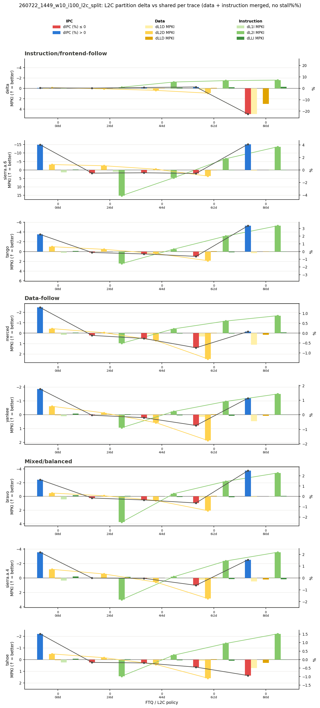
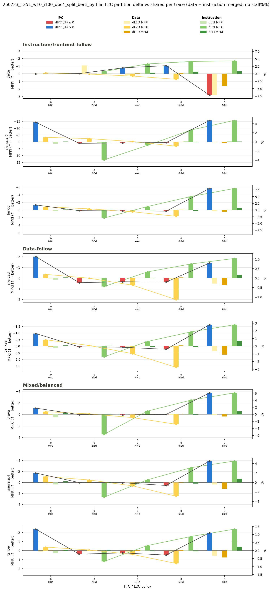

# 2026-07-23 Anal.: 260723_1351_w10_i100_dpc4_split_berti_pythia 결과 분석

`ChampSim_DPC4_Split`에서 L1D `berti`/L2C(및 L2D) `pythia` 프리페처로 L2C partition 정책(6개)을 전체 `l2c_test` set(296 trace, 8 group)에 대해 실행한 결과를 분석한다. 프리페처를 바꾸면 L2C partition 정책의 유불리 경향이 바뀌는지가 핵심 질문이다.

## 비교 대상

| 항목 | 기준(prefetcher 변경 전) | 이번 실행(berti/pythia) |
|---|---|---|
| Run ID / 폴더 | `outputs/260722_1449_w10_i100_champ_split/` | `outputs/260723_1351_w10_i100_dpc4_split_berti_pythia/` |
| ChampSim dir | `ChampSim_Split` | `ChampSim_DPC4_Split` |
| L1D prefetcher | `next_line` | `berti` |
| L2C/L2D prefetcher | `ip_stride` | `pythia` |
| L2I prefetcher | (L2C와 동일) | `no` |
| Trace list | `trace_gtrace_l2c_test.txt` (296, 8 group) | 동일 |
| L2C policy | `shared`/`0i8d`/`2i6d`/`4i4d`/`6i2d`/`8i0d` (`-L2C 0x7b`) | 동일 |
| Warmup / Simulation | 1,000,000 / 10,000,000 | 동일 |

`260722_1449_w10_i100_champ_split`는 `ChampSim_Split`(prefetcher 변경 전, `next_line`/`ip_stride`)에서 8개 trace group 전체를 마지막으로 돌린 run이다. **base 코드가 `ChampSim_Split`와 `ChampSim_DPC4_Split`로 다르다는 점은 caveat로 남는다** — `docs/exp/overview_verification.md`에서 확인했듯 같은 DPC4 계열끼리는 shared/split이 정확히 일치했지만, `ChampSim_Split`와 `ChampSim_DPC4_Split`가 서로 얼마나 가까운지는 별도로 검증되지 않았다. 따라서 이 비교는 "prefetcher 변경 전후 L2C partition 경향"을 보기 위한 것이지, 두 코드베이스의 절대 수치를 동일 선상에서 비교하는 것이 아니다.

## V2 그래프

### prefetcher 변경 전 (`next_line`/`ip_stride`, `260722_1449`)

### prefetcher 변경 후 (`berti`/`pythia`, `260723_1351`)

## 정량 비교: shared 대비 policy별 평균 dIPC%

296개 trace 전체에서 `(IPC_policy - IPC_shared) / IPC_shared * 100`을 policy별로 평균 냈다.

| policy | 평균 dIPC%(변경 전) | 평균 dIPC%(변경 후) | shared보다 좋은 trace 수(변경 전, /296) | shared보다 좋은 trace 수(변경 후, /296) |
|---|---:|---:|---:|---:|
| `0i8d` | +1.889 | +1.775 | 293 | 284 |
| `2i6d` | −0.104 | −0.163 | 69 | 81 |
| `4i4d` | −0.198 | −0.127 | 39 | 81 |
| `6i2d` | −0.530 | −0.206 | 27 | 90 |
| `8i0d` | +0.978 | **+3.230** | 255 | 263 |

## 관찰

- **`0i8d`는 prefetcher와 무관하게 가장 안정적으로 이득이다.** 두 조건 모두 +1.8~1.9%대로 거의 그대로고, 296개 trace 중 280개 이상에서 shared보다 낫다. instruction bypass(0-way)는 프리페처 성능에 별로 좌우되지 않는다는 뜻이다.
- **`8i0d`의 이득이 berti/pythia에서 3배 이상 커졌다**(+0.978% → +3.230%). L2 전체를 instruction에 몰아주고 data가 L2를 완전히 bypass하는 정책인데, data-side 프리페처가 `ip_stride`에서 `berti`(더 정교한 delta/stride 예측)로 바뀌면서 L2 없이도 DRAM/LLC 접근을 더 잘 은닉하게 된 것으로 보인다 — 즉 "약한 프리페처일수록 L2 data capacity가 아쉽고, 강한 프리페처일수록 L2 data capacity를 포기해도 괜찮아진다"는 해석과 맞는다.
- **`2i6d`/`4i4d`/`6i2d`(균형 잡힌 정책들)는 평균은 여전히 거의 0~약간 마이너스**지만, shared보다 나은 trace 수는 대체로 늘었다(`4i4d` 39→81, `6i2d` 27→90). 평균이 그대로인데 "이기는 trace 수"가 늘었다는 건, 일부 trace에서 크게 손해 보던 게 줄고 나머지 trace에서 소폭 이득이 넓게 퍼졌다는 뜻으로 보인다 — 심층 분석하려면 trace별 편차를 따로 봐야 한다.
- v2 그래프 상으로도 `delta` workload의 `8i0d` 손해(빨간 막대)가 변경 전 약 −20%에서 변경 후 약 −7.5%로 줄어든 것이 눈에 띈다 — 프리페처가 강해지면서 극단적 policy의 최악의 경우(worst case)도 완화되는 경향으로 보인다.

## 산출물

- `outputs/260723_1351_w10_i100_dpc4_split_berti_pythia/summary/` — `metrics.csv`(policy별), `l2c_raw_values.csv`, `l2c_delta_pct.csv`, `l2c_delta_raw.csv`, `l2c_delta_grid.png`, `l2c_delta_combined.png`, `l2c_delta_combined_v2.png`
- `docs/image/l2c_delta_combined_v2_260723_1351_berti_pythia.png`, `docs/image/l2c_delta_combined_260723_1351_berti_pythia.png` — 이 문서에 쓴 이미지
- `docs/image/l2c_delta_combined_v2_260722_1449.png` — 비교 기준(prefetcher 변경 전) 이미지

## 다음 계획

- `ChampSim_Split` vs `ChampSim_DPC4_Split`의 base 코드 차이 자체를 검증(둘 다 같은 prefetcher로 맞춰서 shared 비교)해서, 이번 비교에 섞여 있는 base-code caveat를 없앤다.
- `2i6d`/`4i4d`/`6i2d`에서 "이기는 trace 수는 늘었는데 평균은 그대로"인 이유를 trace group별/개별 trace 단위로 더 파본다.
